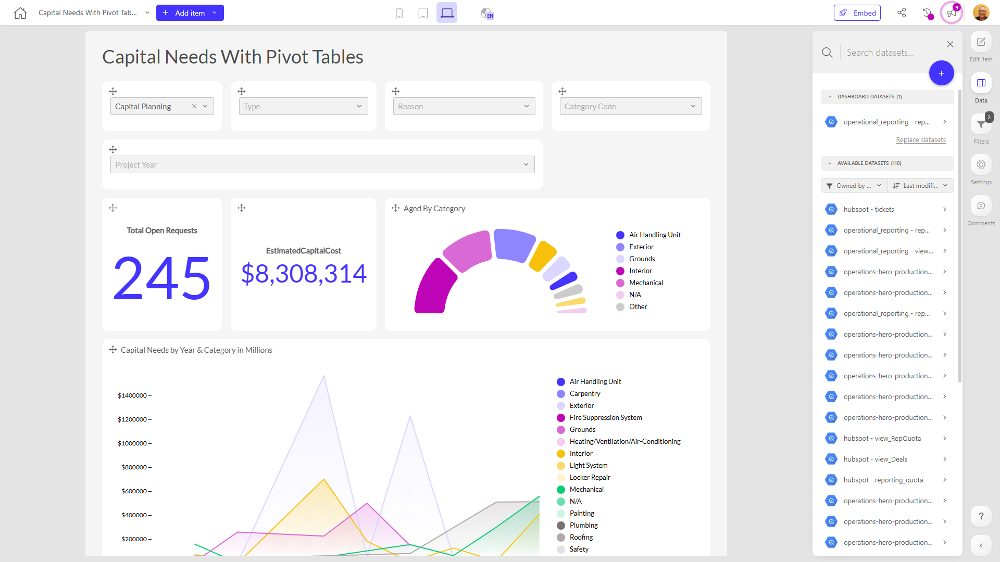

# Capital Needs With Pivot Tables

**Collections:** Production Dashboards

## Screenshot

## Description

The "Capital Needs With Pivot Tables" dashboard provides a comprehensive view of an organization's capital needs and project pipeline. This dashboard is likely used by project managers, facility planners, and financial analysts to understand the current status, costs, and trends related to the organization's capital projects.

The dashboard includes a variety of interactive components that allow users to explore and analyze the capital needs data:

- Dropdown filters allow users to refine the data by different criteria such as location, category, and project year.
- Pivot tables provide detailed breakdowns of estimated capital costs by various dimensions like location, category, and project year.
- Line charts and column/bar charts visualize the capital needs and costs trends over time and by location.
- Donut charts show the distribution of capital needs across different categories.
- Evolution numbers track key metrics like total open requests and total backlog costs.
- A regular data table provides a detailed view of the underlying project data.

By leveraging these interactive components, users can gain insights into:
- The current backlog and pipeline of capital projects
- How capital needs and costs are distributed across different locations, categories, and project years
- Trends in capital needs and costs over time
- The relative priority and scale of different capital project categories

This dashboard would be valuable for executives, finance teams, and operational leaders who need to understand the organization's capital investment requirements, plan budgets, and make informed decisions about project prioritization and resource allocation.

## AI-Generated Summary

The "Capital Needs With Pivot Tables" dashboard provides a comprehensive overview of an organization's capital project pipeline and investment requirements. Leveraging interactive components like dropdown filters, pivot tables, and trend visualizations, this dashboard empowers project managers, facility planners, and financial analysts to gain insights into the current backlog, estimated costs, and investment priorities across different locations, categories, and project years. The dashboard enables users to understand how capital needs are distributed, identify trends over time, and make informed decisions about project prioritization and resource allocation. This valuable tool supports strategic capital planning and budgeting for the organization.

### Tags

`capital planning` `project management` `financial analysis` `facilities management` `budget planning`

---

*Generated on 2026-01-29 12:43:48 by Luzmo API Tools*