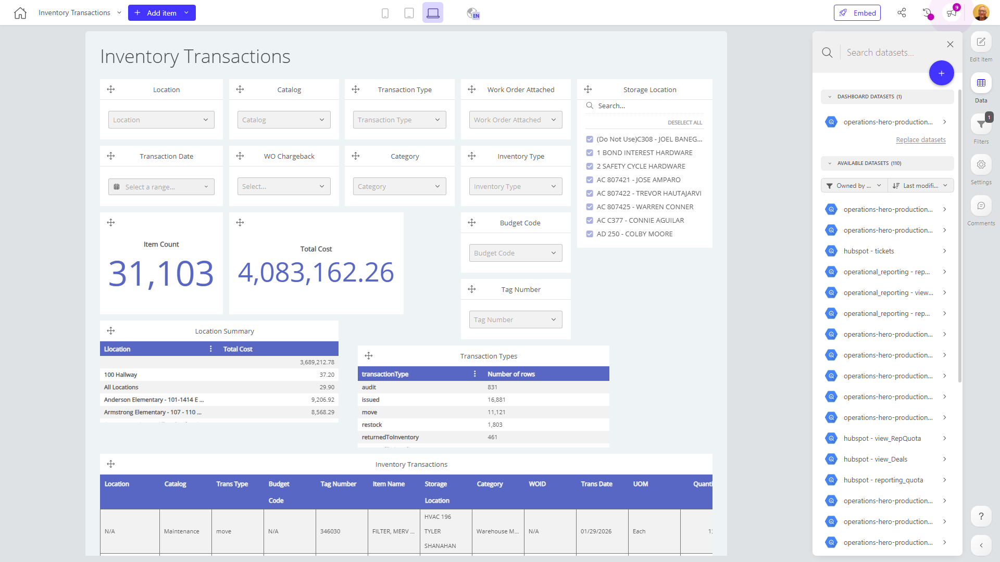

# Inventory Transactions

**Collections:** Production Dashboards

## Screenshot

## Description

The Inventory Transactions dashboard provides a comprehensive view of an organization's inventory management activities. It is designed to help inventory managers, procurement teams, and finance professionals track and analyze various aspects of inventory transactions.

The dashboard includes a variety of components that allow users to:

1. Filter and explore inventory data by different criteria, such as location, catalog, transaction type, work order status, storage location, transaction date, and more. This enables users to quickly identify patterns, trends, and anomalies in the inventory data.

2. Monitor key inventory metrics, including item count, total cost, and budget code information. The evolution-number components display these metrics over time, allowing users to track changes and identify areas for optimization.

3. Analyze inventory transactions at a high level using pivot tables. The "Location Summary" and "Transaction Types" pivot tables provide a detailed breakdown of inventory activity by location and transaction type, respectively.

4. Drill down into individual inventory transactions using the regular table components. These tables display detailed transaction-level data, such as item information, quantities, and costs.

The dashboard integrates data from a single connected dataset and provides a centralized view of an organization's inventory management operations. By leveraging the various filter and analysis components, users can quickly identify areas of concern, make informed decisions, and optimize inventory management processes.

Overall, the Inventory Transactions dashboard serves as a valuable tool for inventory managers, procurement teams, and finance professionals who need to monitor, analyze, and optimize an organization's inventory operations.

## AI-Generated Summary

The Inventory Transactions dashboard provides a comprehensive view of an organization's inventory management activities, empowering inventory managers, procurement teams, and finance professionals to track, analyze, and optimize their inventory operations. With its wide range of filter and analysis components, users can quickly identify patterns, trends, and anomalies in inventory data, monitor key metrics, and drill down into individual transactions. The dashboard serves as a valuable tool for making informed decisions, identifying areas for improvement, and enhancing overall inventory management processes.

### Tags

`inventory management` `procurement` `finance` `operations` `analytics`

## Filters

This dashboard has **3 interactive filters**:

- **Filter 1** (slicer-filter)
- **Filter 2** (slicer-filter)
- **Filter 3** (slicer-filter)

---

*Generated on 2026-01-29 12:46:47 by Luzmo API Tools*