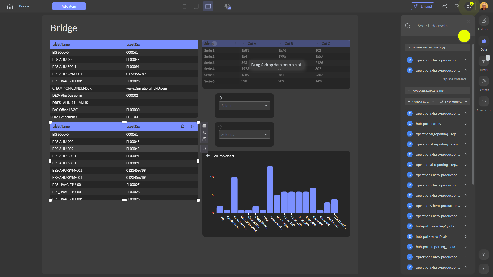

# Bridge

**Collections:** None

## Screenshot

## Description

The "Bridge" dashboard appears to be a comprehensive reporting and analysis tool for monitoring and understanding various aspects of a business. Based on the metadata provided, this dashboard contains a diverse set of components that likely allow users to explore and gain insights from the underlying data.

The dashboard features a combination of regular tables, pivot tables, column charts, and dropdown filters, suggesting that it covers a range of data presentation and analysis capabilities. The regular tables likely display detailed, line-item level information, while the pivot tables and column charts provide more aggregated, high-level views of the data.

The dropdown filters suggest that users can interact with the dashboard to slice and dice the data based on different criteria, such as product, region, or time period. This flexibility allows users to focus on the specific aspects of the business that are most relevant to their needs.

Given the variety of component types and the fact that the dashboard connects to two different datasets, it is likely that this dashboard serves a broad audience within the organization. It could be used by executives, managers, and analysts to monitor key performance indicators, identify trends, and make informed decisions about the business.

The dashboard's purpose seems to be to provide a centralized, interactive platform for users to access, analyze, and interpret data related to the organization's operations, sales, or other business functions. By combining multiple data visualization and exploration tools, the "Bridge" dashboard empowers users to gain a comprehensive understanding of the business, identify areas for improvement, and make data-driven decisions.

## AI-Generated Summary

The "Bridge" dashboard is a comprehensive reporting and analysis tool that provides users with a centralized view of key business data. This interactive dashboard empowers executives, managers, and analysts to monitor performance, identify trends, and make data-driven decisions across various aspects of the organization.

The dashboard features a diverse set of components, including regular tables for detailed data exploration, pivot tables and column charts for high-level analysis, and dropdown filters for data slicing and dicing. Users can leverage these tools to gain insights into the organization's operations, sales, and other business functions.

By combining multiple data visualization and exploration capabilities, the "Bridge" dashboard serves as a versatile platform that can address the needs of a broad audience within the organization. Whether users are interested in monitoring key performance indicators, identifying areas for improvement, or making strategic decisions, the "Bridge" dashboard provides the necessary data and analytical capabilities to support their goals.

### Tags

`business-intelligence` `data-visualization` `performance-monitoring` `operational-analysis` `decision-support`

---

*Generated on 2026-01-29 11:53:59 by Luzmo API Tools*