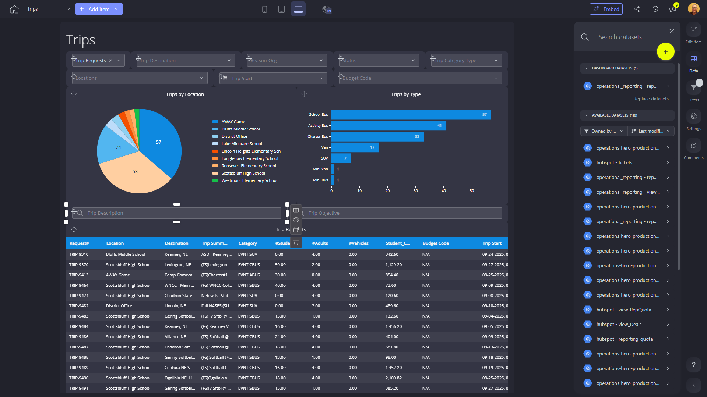

# Trips

**Collections:** Client Dashboards, Production Dashboards

## Screenshot

## Description

This "Trips" dashboard is a comprehensive tool designed to provide insights and visibility into an organization's trip request management. With a total of 51 components, it offers a wide range of analytical capabilities to help users understand and monitor various aspects of their trip requests.

The dashboard features an array of filters and selection tools, including 24 dropdown filters, 6 search filters, and 3 date filters. These enable users to quickly narrow down and explore the data based on specific criteria, such as location, trip type, and date range.

The main visualizations included in the dashboard are:
- Donut charts that show the breakdown of trips by location
- Bar charts that illustrate the distribution of trips by type
- Column charts that provide a visual representation of trips by location
- Regular tables that display detailed trip request information

Additionally, the dashboard incorporates evolution numbers to track the total number of trip requests over time, as well as a pivot table for more advanced analysis and reporting.

This dashboard would be highly valuable for managers, logistics coordinators, and business analysts who need to oversee and manage the organization's trip request processes. It allows them to identify trends, spot anomalies, and make data-driven decisions to optimize trip planning, resource allocation, and overall operational efficiency.

By providing a centralized and interactive view of trip-related data, this dashboard empowers users to gain a comprehensive understanding of their organization's travel patterns, identify areas for improvement, and make informed decisions to enhance the overall trip management experience.

## AI-Generated Summary

The "Trips" dashboard is a comprehensive tool designed to provide deep insights and visibility into an organization's trip request management processes. With a wide range of analytical capabilities, this dashboard empowers managers, logistics coordinators, and business analysts to understand, monitor, and optimize the organization's travel patterns and trip planning.

The dashboard offers a central view of trip-related data, including the breakdown of trips by location, type, and volume over time. Users can leverage advanced filtering and selection tools to quickly explore the data based on specific criteria, such as location, trip type, and date range. This enables them to identify trends, spot anomalies, and make data-driven decisions to enhance the overall efficiency of the organization's trip management operations.

By providing a unified and interactive platform for trip request information, this dashboard helps users gain a holistic understanding of their organization's travel dynamics. This supports informed decision-making, resource optimization, and the continuous improvement of the trip planning and management processes.

### Tags

`trip management` `travel analytics` `operational efficiency` `data-driven decision making` `logistics optimization`

---

*Generated on 2026-01-29 11:52:53 by Luzmo API Tools*