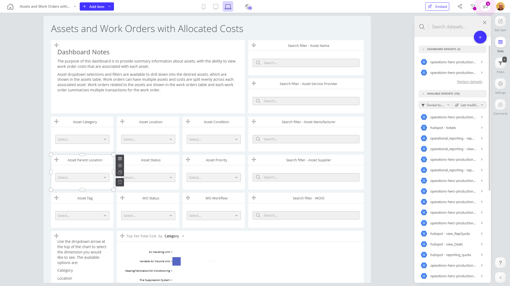

# Assets and Work Orders with Allocated Costs

**Collections:** Production Dashboards

## Screenshot

## Description

This dashboard, titled "Assets and Work Orders with Allocated Costs," provides a comprehensive view of a company's asset management and work order operations. It is designed to help asset managers, maintenance teams, and finance professionals understand the allocation of costs across the company's assets and work orders.

The dashboard features a range of interactive components that allow users to filter, search, and analyze data related to the company's assets and work orders. This includes filters for asset attributes like name, service provider, category, location, condition, manufacturer, status, and priority, as well as work order status and workflow.

The key insights and value this dashboard provides include:

1. Asset Management: Users can quickly identify and analyze the company's assets, including their status, condition, and location. This helps asset managers make informed decisions about maintenance, replacement, and resource allocation.

2. Work Order Analysis: The dashboard enables users to track work orders, including their status and workflow, and understand the associated costs. This information can help maintenance teams optimize their processes and ensure efficient use of resources.

3. Cost Allocation: The dashboard includes a pivot table and a bar chart that provide detailed insights into the allocated costs per asset and the top 10 assets with the highest total costs. This information is valuable for finance professionals and decision-makers to understand cost drivers and make data-driven budgeting and investment decisions.

By consolidating these various data sources and visualization types, this dashboard serves as a powerful tool for asset managers, maintenance teams, and finance professionals to gain a comprehensive understanding of their asset and work order operations, identify areas for improvement, and make informed decisions to optimize the company's overall performance.

## AI-Generated Summary

This dashboard provides a comprehensive view of a company's asset management and work order operations, enabling asset managers, maintenance teams, and finance professionals to understand the allocation of costs across the company's assets and work orders. The dashboard features a range of interactive filters and visualizations, allowing users to analyze asset details, track work order status and workflow, and gain insights into cost allocation. Key insights include asset management, work order analysis, and detailed cost allocation information, which supports data-driven decision-making for optimizing asset performance, maintenance processes, and overall financial management.

### Tags

`asset management` `work orders` `cost allocation` `maintenance` `finance`

---

*Generated on 2026-01-29 12:48:01 by Luzmo API Tools*