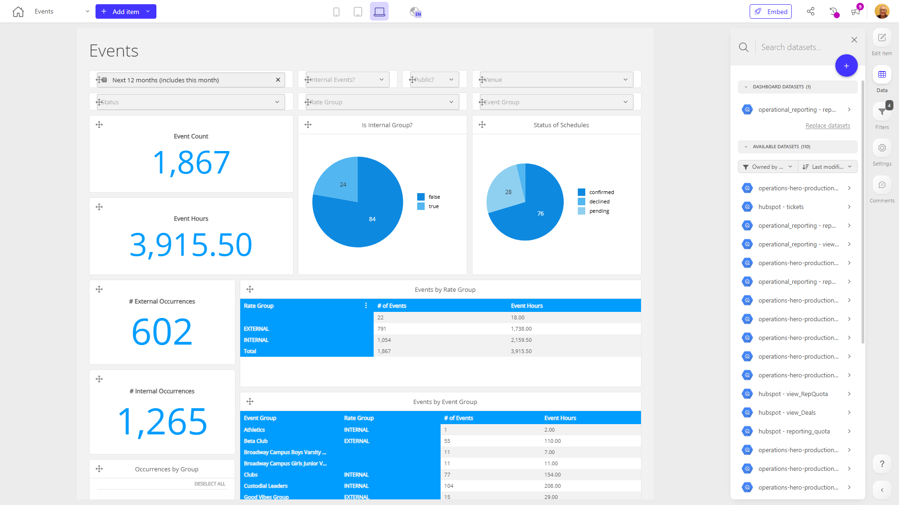

# Events

**Collections:** HeroHQ Dashboards, Production Dashboards

## Screenshot

## Description

This "Events" dashboard provides a comprehensive view of an organization's event-related data and activities. It is likely used by event managers, coordinators, and other stakeholders who need to monitor, analyze, and report on various aspects of the organization's events.

The dashboard contains a variety of components that allow users to:

1. Filter and segment the event data by different criteria, such as event start date, internal/external events, venue, status, and event group.
2. Track the overall event count and the number of internal and external event occurrences over time.
3. Analyze the status of event schedules, including the proportion of internal and external events.
4. Understand the distribution of events by rate group, event group, and venue through pivot table visualizations.
5. Explore a detailed data table with event-level information.

The combination of filters, time-series metrics, donut charts, and pivot tables enables users to quickly identify trends, spot anomalies, and gain insights into the organization's event portfolio. This dashboard would be valuable for event planning, resource allocation, performance tracking, and reporting purposes.

Overall, this dashboard provides a centralized and interactive way for users to monitor, analyze, and manage the organization's events, supporting informed decision-making and more effective event management.

## AI-Generated Summary

This "Events" dashboard provides a comprehensive view of an organization's event-related data and activities. It is designed to help event managers, coordinators, and other stakeholders monitor, analyze, and report on various aspects of the organization's events. The dashboard enables users to filter and segment event data, track event counts and status over time, understand the distribution of events by different criteria, and explore detailed event-level information. The combination of interactive visualizations and data tables allows users to quickly identify trends, spot anomalies, and gain insights that support informed decision-making and more effective event management.

### Tags

`event management` `business analytics` `performance tracking` `resource allocation` `reporting`

## Filters

This dashboard has **3 interactive filters**:

- **Filter 1** (slicer-filter)
- **Filter 2** (slicer-filter)
- **Filter 3** (slicer-filter)

---

*Generated on 2026-01-29 12:45:39 by Luzmo API Tools*