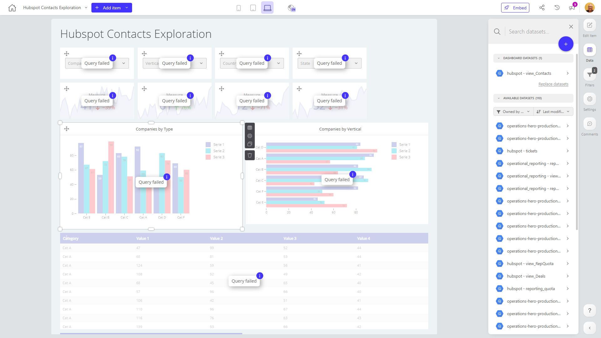

# Hubspot Contacts Exploration

**Collections:** None

## Screenshot

## Description

The "Hubspot Contacts Exploration" dashboard provides a comprehensive view of a company's Hubspot contacts data, allowing users to analyze and gain insights into their customer base. This dashboard is likely used by sales, marketing, and customer success teams to better understand their contacts and how they are engaging with the business.

The dashboard features a variety of components, including:

- Dropdown filters: These allow users to segment and explore the data by different criteria, such as company type, vertical, and more.
- Evolution numbers: These components show the trends and changes in key metrics over time, such as the number of contacts with no email or contacts who have opted out of email communications.
- Column and bar charts: These visualizations provide an at-a-glance understanding of the distribution of companies by type and vertical.
- Regular and pivot tables: These tabular components give users a detailed view of the contact data, enabling them to dive deeper into the information.

With this dashboard, users can answer questions such as:
- What are the most common company types and verticals among our contacts?
- How is the number of contacts with no email or who have opted out changing over time?
- Which companies or contact segments are most engaged or disengaged?

By providing these insights, the "Hubspot Contacts Exploration" dashboard empowers sales, marketing, and customer success teams to make more informed decisions, identify opportunities, and optimize their strategies for nurturing and engaging with their customer base.

## AI-Generated Summary

The "Hubspot Contacts Exploration" dashboard provides a comprehensive view of a company's Hubspot contacts data, enabling sales, marketing, and customer success teams to analyze their customer base and gain valuable insights. With a range of components, including dropdown filters, evolution numbers, column and bar charts, and regular and pivot tables, users can explore contact data by various criteria such as company type and vertical. This dashboard empowers teams to answer key questions, such as understanding the most common company profiles, tracking changes in engaged vs. disengaged contacts over time, and identifying opportunities to optimize their customer engagement strategies.

### Tags

`hubspot` `customer analysis` `contact management` `sales intelligence` `marketing analytics`

---

*Generated on 2026-01-29 12:43:33 by Luzmo API Tools*