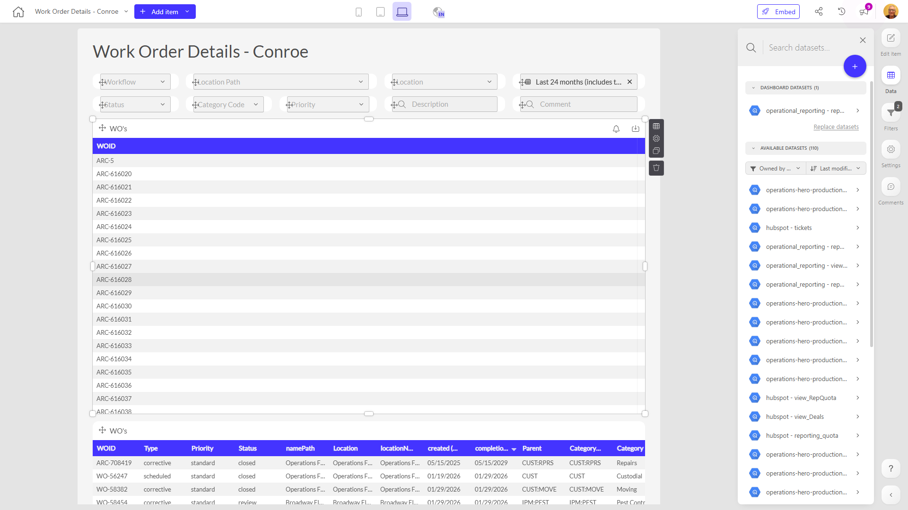

# Work Order Details - Conroe

**Collections:** None

## Screenshot

## Description

The "Work Order Details - Conroe" dashboard provides a comprehensive view of work orders for a specific location, Conroe. This dashboard is likely used by operations or maintenance teams to track and manage work orders in the Conroe area.

The dashboard includes a variety of filter and search components that allow users to quickly find and sort work orders based on different criteria, such as:
- Search & Select filters to find work orders by specific attributes or characteristics
- Date filters to view work orders within a specific time period
- Search filters to perform free-text searches across work order details

The dashboard also includes three regular tables that display the detailed information about the work orders, such as work order numbers, descriptions, status, and other relevant details.

By providing these interactive filtering and search capabilities, along with the detailed work order data, this dashboard enables users to quickly identify, review, and manage the work orders for the Conroe location. This information could be used to analyze work order trends, identify problem areas, allocate resources, and ensure timely completion of critical work.

Overall, this dashboard serves as a central hub for work order management and visibility for the Conroe operation, supporting better decision-making and operational efficiency.

## AI-Generated Summary

The "Work Order Details - Conroe" dashboard provides a comprehensive view of work orders for the Conroe location, enabling operations and maintenance teams to track, manage, and analyze work order data. With interactive filtering and search capabilities, users can quickly identify, review, and monitor work orders based on various criteria such as work order attributes, status, and dates. This dashboard supports better decision-making, resource allocation, and operational efficiency by delivering detailed work order information in a centralized and accessible format.

### Tags

`work orders` `operations management` `maintenance` `data analytics` `location-based reporting`

---

*Generated on 2026-01-29 12:44:28 by Luzmo API Tools*