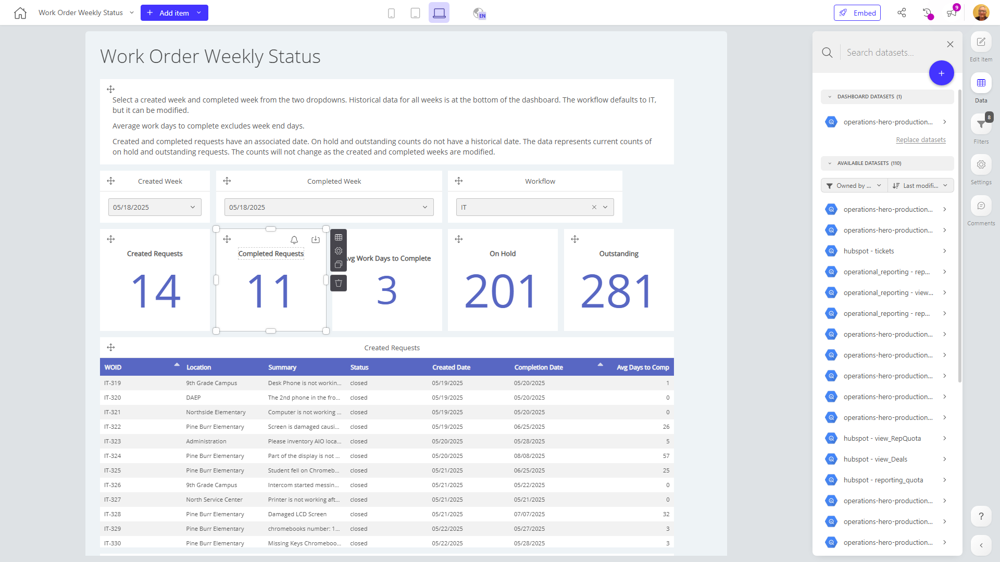

# Work Order Weekly Status

**Collections:** Client Dashboards, Production Dashboards

## Screenshot

## Description

The "Work Order Weekly Status" dashboard is designed to provide a comprehensive view of the company's work order management process. This dashboard is likely used by operations managers, project managers, and other stakeholders who need to track and monitor the status of work orders on a weekly basis.

The dashboard is composed of 39 components, including:
- 15 evolution-number components that display key metrics such as Created Requests, Completed Requests, Average Work Days to Complete, and the number of work orders On Hold.
- 9 dropdown-filter components that allow users to filter the data by Workflow, Created Week, and Completed Week.
- 9 regular-table components that provide detailed information on Created Requests, Completed Requests, and Outstanding Requests.
- 3 line-chart components that visualize the trend of Created Requests by week.
- 3 text components that provide additional context or labeling for the dashboard.

The key insights and questions this dashboard aims to answer include:
- What is the weekly volume of work orders created and completed?
- How long does it take, on average, to complete work orders?
- What is the current status of outstanding work orders, and how many are on hold?
- Are there any trends or patterns in work order creation and completion over time?

By providing a comprehensive view of work order status, this dashboard empowers operations and project managers to monitor performance, identify bottlenecks, and make informed decisions to optimize the work order management process. The ability to filter by workflow, created week, and completed week allows users to dive deeper into the data and analyze specific areas of interest.

Overall, the "Work Order Weekly Status" dashboard is a valuable tool for organizations that need to closely track and manage their work order operations, enabling data-driven decision-making and process improvements.

## AI-Generated Summary

The "Work Order Weekly Status" dashboard provides a comprehensive view of the company's work order management process, empowering operations and project managers to monitor performance, identify bottlenecks, and make informed decisions to optimize the work order management process. This dashboard answers key questions such as the weekly volume of work orders created and completed, the average time to complete work orders, the current status of outstanding work orders, and any trends or patterns in work order creation and completion over time. The ability to filter by workflow, created week, and completed week allows users to dive deeper into the data and analyze specific areas of interest. This dashboard is a valuable tool for organizations that need to closely track and manage their work order operations, enabling data-driven decision-making and process improvements.

### Tags

`work orders` `operations management` `project management` `performance monitoring` `data-driven decision making`

---

*Generated on 2026-01-29 12:44:31 by Luzmo API Tools*