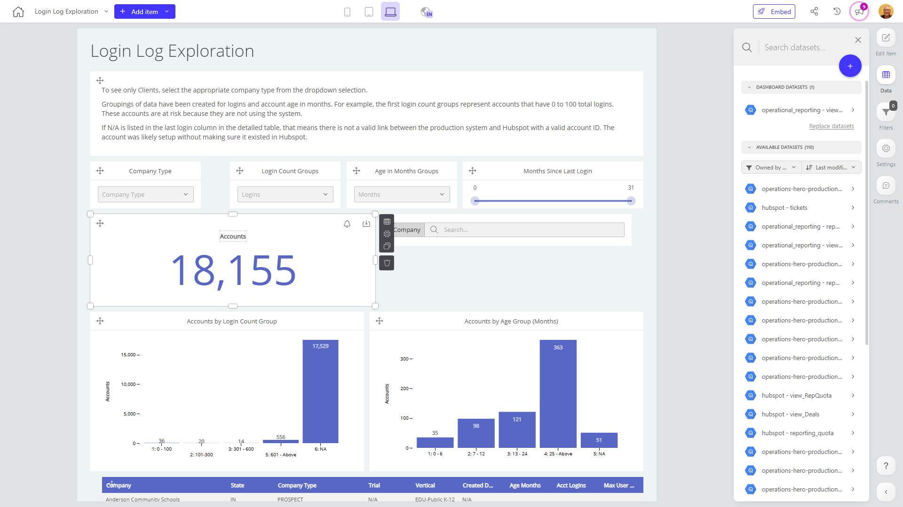

# Login Log Exploration

**Collections:** Internal

## Screenshot

## Description

This dashboard, titled "Login Log Exploration", is designed to provide insights into user login activity and account demographics for a business. It appears to be a comprehensive tool that allows users to analyze and explore various aspects of login behavior and account characteristics.

The dashboard consists of 30 components, including filters, charts, tables, and metrics that enable users to dive deep into the login data. The key components include:

1. Filters: Dropdown filters for "Company Type", "Login Count Groups", and "Age in Months Groups", as well as a slider filter for "Months Since Last Login". These filters allow users to segment and explore the data based on different criteria.

2. Charts: Two column charts that visualize the "Accounts by Login Count Group" and "Accounts by Age Group (Months)". These charts provide a clear, data-driven view of how the user accounts are distributed across different login count and age groups.

3. Tables: Two regular tables that likely display detailed, row-level data about the user accounts, complementing the high-level insights from the charts.

4. Metrics: Three "evolution-number" components that likely track the overall "Accounts" metric, allowing users to monitor changes over time.

5. Search: A search filter component that enables users to quickly find and explore specific user accounts or login events.

This dashboard would be highly valuable for business stakeholders, such as marketing, operations, or customer success teams, who need to understand user behavior, identify trends, and potentially detect any issues or opportunities related to user logins and account management. By providing a comprehensive view of login data and account demographics, this dashboard can help inform strategic decisions, improve customer experience, and drive business growth.

## AI-Generated Summary

The "Login Log Exploration" dashboard provides a comprehensive view of user login activity and account demographics for a business. This dashboard empowers stakeholders, such as marketing, operations, and customer success teams, to analyze login trends, identify user behavior patterns, and make informed decisions to enhance the customer experience and drive business growth.

The dashboard offers a range of filters and visualizations, allowing users to segment and explore the data by factors like company type, login count, account age, and time since last login. Key insights include the distribution of accounts across login count and age groups, as well as the overall account metrics and search capabilities to quickly find and investigate specific user accounts or login events.

This dashboard delivers valuable intelligence that can help businesses better understand their user base, detect potential issues or opportunities, and make data-driven decisions to optimize login processes, tailor customer engagement, and ultimately improve business outcomes.

### Tags

`user analytics` `login monitoring` `customer demographics` `account management` `business intelligence`

---

*Generated on 2026-01-29 12:46:19 by Luzmo API Tools*