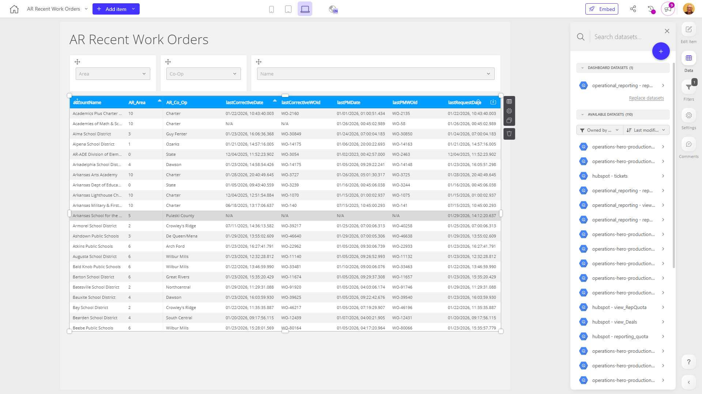

# AR Recent Work Orders

**Collections:** Client Dashboards, Production Dashboards

## Screenshot

## Description

The "AR Recent Work Orders" dashboard is designed to provide a comprehensive view of recent work orders for an organization's Accounts Receivable (AR) team. This dashboard consolidates relevant information from a single connected dataset, allowing AR professionals to quickly analyze and monitor the status of their recent work orders.

The dashboard consists of 12 components, primarily featuring 9 dropdown-style filters and 3 regular data tables. The filters allow users to refine the work order data based on various search and selection criteria, such as specific customers, order types, or time periods. This flexibility enables the AR team to drill down into the most relevant work order information for their analysis and decision-making.

The three data tables display the details of the recent work orders, providing a clear and structured view of key information such as order status, customer details, and order-specific metrics. This allows the AR team to quickly identify any outstanding or high-priority work orders that require immediate attention.

Overall, this dashboard serves as a valuable tool for the AR team, enabling them to efficiently manage and monitor their recent work orders. By leveraging the combination of intuitive filters and comprehensive data tables, the dashboard helps answer critical questions about the organization's AR operations, such as identifying areas for process improvement, tracking customer payment trends, and ensuring timely resolution of work orders. This dashboard would be particularly useful for AR managers, analysts, and other stakeholders responsible for overseeing the organization's accounts receivable activities.

## AI-Generated Summary

The "AR Recent Work Orders" dashboard provides a comprehensive view of recent work orders for an organization's Accounts Receivable (AR) team. This dashboard consolidates relevant information, allowing AR professionals to quickly analyze and monitor the status of their recent work orders. The dashboard features flexible filters that enable the AR team to drill down into the most relevant work order information for their analysis and decision-making. The data tables display key details of the recent work orders, helping the AR team identify outstanding or high-priority work orders that require immediate attention. This dashboard serves as a valuable tool for AR managers, analysts, and stakeholders responsible for overseeing the organization's accounts receivable activities, enabling them to efficiently manage and monitor their recent work orders, identify areas for process improvement, and track customer payment trends.

### Tags

`accounts receivable` `work orders` `ar operations` `data monitoring` `process management`

---

*Generated on 2026-01-29 12:44:08 by Luzmo API Tools*