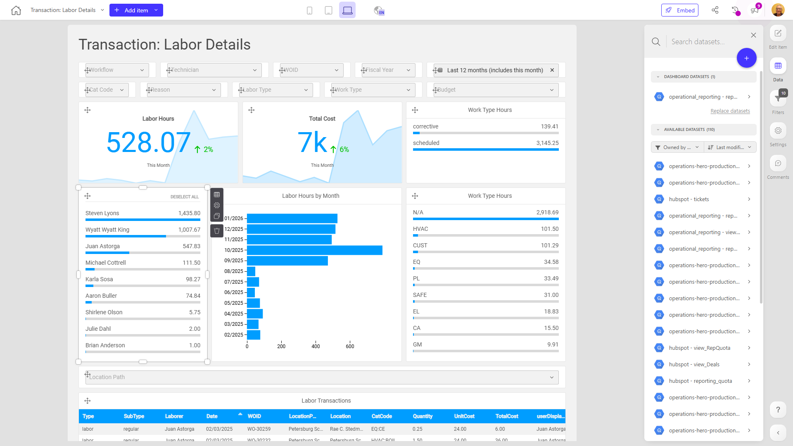

# Transaction: Labor Details

**Collections:** Client Dashboards, Production Dashboards

## Screenshot

## Description

The "Transaction: Labor Details" dashboard provides a comprehensive view of labor-related transactions for an organization. This dashboard is likely used by managers, finance teams, or operations personnel to monitor and analyze labor costs, hours, and performance.

The dashboard includes a variety of interactive components that allow users to filter, slice, and visualize labor data in different ways:

- Dropdown filters enable users to explore data by various dimensions such as transaction type, technician, work order ID, supplier/vendor, and more.
- Pivot tables and bar charts provide a high-level summary of labor hours by location and work type.
- Evolution number components track key metrics like monthly labor hours and total labor transactions over time.
- Slicer filters allow users to focus on specific work types and rank labor hours.
- A detailed transactions table gives users a granular view of individual labor records.

With this dashboard, users can answer questions such as:
- How are labor hours and costs distributed across different work types and locations?
- Which technicians or suppliers/vendors are driving the highest labor costs?
- How have labor hours and transactions trended over time?
- Which work orders or job types are consuming the most labor resources?

This dashboard serves as a centralized hub for labor-related data, empowering stakeholders to make informed decisions about resource allocation, cost management, and operational efficiency.

## AI-Generated Summary

The "Transaction: Labor Details" dashboard provides a comprehensive view of labor-related transactions for an organization. This dashboard is likely used by managers, finance teams, or operations personnel to monitor and analyze labor costs, hours, and performance. The dashboard includes interactive components that allow users to filter, slice, and visualize labor data by various dimensions such as transaction type, technician, work order ID, and supplier/vendor. Users can explore labor hours and costs across different work types and locations, identify top labor drivers, track trends over time, and view detailed transaction records. This dashboard serves as a centralized hub for labor-related data, empowering stakeholders to make informed decisions about resource allocation, cost management, and operational efficiency.

### Tags

`labor management` `work orders` `operations analytics` `resource allocation` `cost management`

## Filters

This dashboard has **9 interactive filters**:

- **Filter 1** (slicer-filter)
- **Filter 2** (slicer-filter)
- **Filter 3** (slicer-filter)
- **Filter 4** (slicer-filter)
- **Filter 5** (slicer-filter)
- **Filter 6** (slicer-filter)
- **Filter 7** (slicer-filter)
- **Filter 8** (slicer-filter)
- **Filter 9** (slicer-filter)

---

*Generated on 2026-01-29 12:47:48 by Luzmo API Tools*