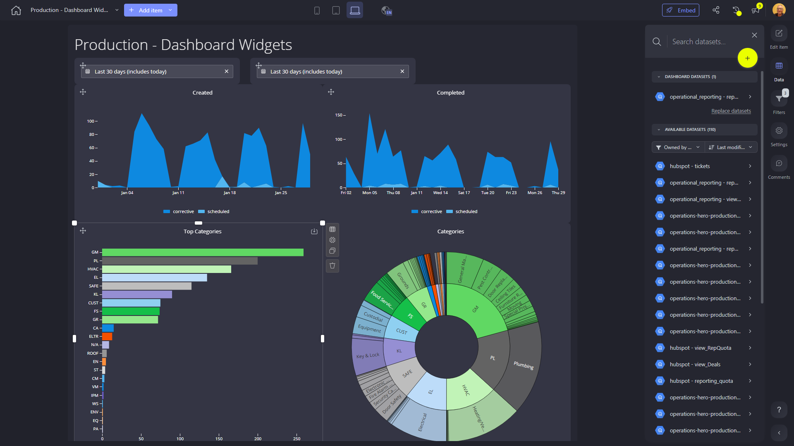

# Production - Dashboard Widgets

**Collections:** HeroHQ Dashboards, Production Dashboards

## Screenshot

## Description

This "Production - Dashboard Widgets" dashboard is designed to provide insights and analysis for a production-focused business. Based on the component types and names, it appears to be a comprehensive dashboard that tracks and visualizes key production metrics and trends.

The dashboard includes a variety of chart types, including area charts, bar charts, and sunburst charts, which provide different views and analysis of the production data. Some of the key metrics and insights this dashboard likely delivers include:

- Tracking and trending the number of items created and completed over time using the "Created" and "Completed" area charts. This allows the user to monitor production output and identify any changes or patterns.

- Analyzing the top product categories or types being produced using the "Top Categories" bar chart and the more detailed "Categories" sunburst chart. This provides visibility into product mix and distribution.

- Enabling filtering and segmentation of the data through the multiple date filters and a slicer component. This allows the user to explore the data from different time periods or break it down by specific attributes.

The dashboard also appears to be connected to a single dataset and has one parameter, suggesting it is part of a broader reporting or analytics solution.

Overall, this dashboard is likely used by production managers, operations leaders, or others responsible for overseeing and optimizing the manufacturing or assembly process. It provides a comprehensive view of key production metrics and trends to help drive data-informed decision-making and continuous improvement.

## AI-Generated Summary

This "Production - Dashboard Widgets" dashboard provides comprehensive insights and analysis for a production-focused business. It tracks and visualizes key production metrics and trends, including the volume of items created and completed over time, the top product categories being produced, and the ability to filter and segment the data.

The dashboard's various chart types, such as area charts, bar charts, and sunburst charts, enable production managers, operations leaders, and other stakeholders to monitor production output, analyze product mix, and identify patterns or changes in the manufacturing or assembly process. The filtering and slicing capabilities allow users to explore the data from different time periods or break it down by specific attributes, supporting data-driven decision-making and continuous improvement efforts.

### Tags

`production` `operations` `manufacturing` `product mix` `data visualization`

## Filters

This dashboard has **3 interactive filters**:

- **Filter 1** (slicer-filter)
- **Filter 2** (slicer-filter)
- **Filter 3** (slicer-filter)

---

*Generated on 2026-01-29 12:43:21 by Luzmo API Tools*