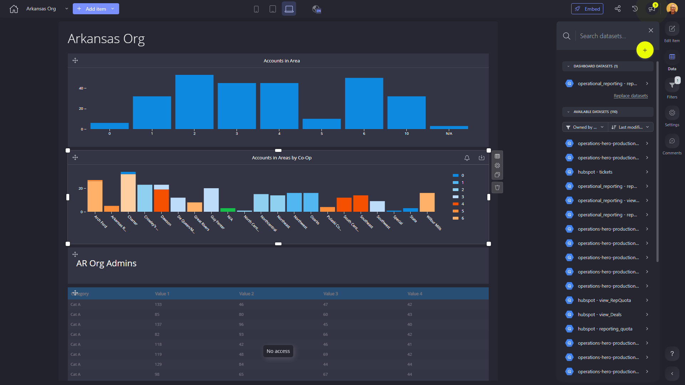

# Arkansas Org

**Collections:** Arkansas

## Screenshot

## Description

This dashboard is designed to provide a comprehensive view of the organization's accounts and operations in Arkansas. It appears to be a valuable tool for managers, analysts, and decision-makers who need to understand the performance and distribution of accounts across different areas and co-ops within the state.

The dashboard contains a variety of component types that work together to deliver important insights:

- The one-number components display key account metrics, such as total accounts, accounts in specific areas, and accounts associated with different co-ops. These high-level metrics give users a quick overview of the organization's standing.
- The column charts provide a visual representation of accounts by area and co-op, allowing users to easily identify trends and patterns in the distribution of accounts.
- The regular tables offer detailed data on the accounts, enabling users to dive deeper into the information and perform further analysis.
- The selectbox components give users the ability to filter and explore the data based on specific criteria, such as area, co-op, or other relevant factors.

Additionally, the "Text" component likely provides context or explanations to help users interpret the dashboard's content.

Overall, this dashboard appears to be a powerful tool for understanding the organization's presence and performance in Arkansas. It allows users to quickly assess key metrics, analyze account distributions, and drill down into the underlying data to make informed decisions and optimize the organization's operations in the state.

## AI-Generated Summary

This dashboard provides a comprehensive view of the organization's accounts and operations in Arkansas. It allows managers, analysts, and decision-makers to quickly assess key account metrics, analyze account distributions across different areas and co-ops, and drill down into detailed data to make informed decisions and optimize the organization's operations in the state. The dashboard includes high-level account metrics, visual representations of account distribution, and detailed data tables, all of which can be filtered and explored using interactive selection components. This dashboard is a valuable tool for understanding the organization's presence and performance in Arkansas.

### Tags

`arkansas operations` `account management` `business intelligence` `data visualization` `performance tracking`

---

*Generated on 2026-01-29 12:42:29 by Luzmo API Tools*