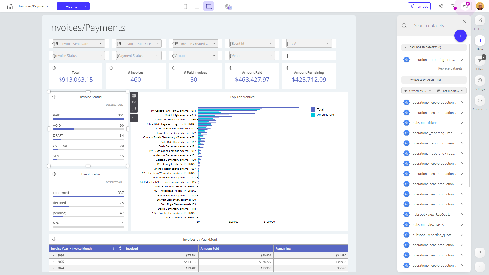

# Invoices/Payments

**Collections:** Internal, Production Dashboards

## Screenshot

## Description

This "Invoices/Payments" dashboard provides a comprehensive view of an organization's invoicing and payment activities. Designed for finance and accounting teams, it delivers valuable insights to help monitor and manage the invoicing process.

The dashboard consists of 72 components across various visualizations and filters, allowing users to analyze invoicing data from multiple angles:

- Date filters allow users to view data for specific time periods.
- Dropdown filters enable drilling down into details like customer, product, or service.
- Evolution numbers track key metrics such as total invoices, amount paid, and amount remaining.
- Pivot tables and charts show invoice trends by year, month, status, and event status.
- Bar charts and column charts highlight top performing venues and open invoice totals by due month.

These components work together to answer questions like:
- What is the current status of our outstanding invoices?
- Which customers or venues are generating the most invoice volume?
- How have our invoicing and payment patterns changed over time?

By providing this holistic view of invoicing activities, the dashboard empowers finance teams to better manage cash flow, identify payment issues, and optimize invoicing processes. The insights derived from this dashboard can also inform strategic decisions around credit terms, customer relationships, and resource allocation.

Overall, this "Invoices/Payments" dashboard is a powerful tool that helps organizations maintain a healthy invoicing and collections function, leading to improved financial performance and customer satisfaction.

## AI-Generated Summary

This "Invoices/Payments" dashboard provides a comprehensive view of an organization's invoicing and payment activities. Designed for finance and accounting teams, it delivers valuable insights to help monitor and manage the invoicing process. The dashboard allows users to analyze invoice data from multiple angles, including tracking key metrics like total invoices, amount paid, and amount remaining. It also provides date and dropdown filters, as well as visualizations like pivot tables, charts, and evolution numbers to uncover trends in invoicing by year, month, status, and more. This dashboard empowers finance teams to better manage cash flow, identify payment issues, and optimize invoicing processes, leading to improved financial performance and customer satisfaction.

### Tags

`invoicing` `payments` `finance` `accounting` `cash flow`

## Filters

This dashboard has **6 interactive filters**:

- **Filter 1** (slicer-filter)
- **Filter 2** (slicer-filter)
- **Filter 3** (slicer-filter)
- **Filter 4** (slicer-filter)
- **Filter 5** (slicer-filter)
- **Filter 6** (slicer-filter)

---

*Generated on 2026-01-29 11:52:42 by Luzmo API Tools*