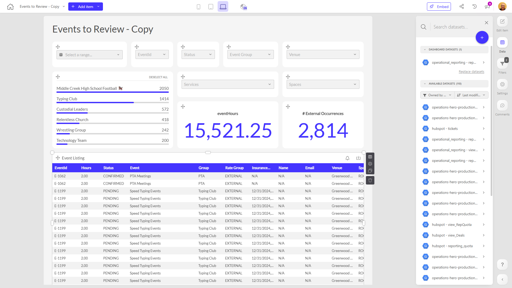

# Events to Review - Copy

**Collections:** None

## Screenshot

## Description

This "Events to Review - Copy" dashboard appears to be a comprehensive tool for managing and analyzing various types of events and their associated data. Based on the component types and names, it seems designed to provide event organizers, managers, and operations teams with a centralized view and set of controls for monitoring and reviewing upcoming and past events.

The dashboard features a range of filter and slicer components that allow users to quickly narrow down and explore events by factors such as start date, status, event group, venue, and whether the event is internal or external. This provides users the ability to slice and dice the event data in multiple ways to uncover insights and identify patterns.

The regular table components suggest the dashboard likely displays detailed information about specific events, such as event listings, services, and spaces. This would allow users to drill into the specifics of individual events and understand the various details and resources involved.

The evolution number components indicate the dashboard also tracks and trends certain key metrics over time, such as total event hours and the number of external event occurrences. This time-series data can help users understand the performance and scale of the event program as a whole.

Overall, this dashboard seems to be a valuable tool for event managers and operators who need a centralized, flexible interface for monitoring, reviewing, and optimizing their event-related activities and outcomes. The combination of filtering, detailed event data, and performance trending enables data-driven decisions around resource allocation, event planning, and process improvements.

## AI-Generated Summary

This "Events to Review - Copy" dashboard provides event managers, organizers, and operations teams with a comprehensive view and set of controls for monitoring, reviewing, and optimizing their event programs. The dashboard features flexible filtering, detailed event data, and performance trending capabilities, enabling users to quickly identify patterns, uncover insights, and make data-driven decisions around resource allocation, event planning, and process improvements. Key features include event listings, services, and spaces; time-series metrics like event hours and external event occurrences; and the ability to slice and dice the data by factors like start date, status, event group, venue, and internal/external events.

### Tags

`event management` `operations analytics` `performance tracking` `data-driven decisions` `resource optimization`

## Filters

This dashboard has **3 interactive filters**:

- **Filter 1** (slicer-filter)
- **Filter 2** (slicer-filter)
- **Filter 3** (slicer-filter)

---

*Generated on 2026-01-29 12:46:27 by Luzmo API Tools*