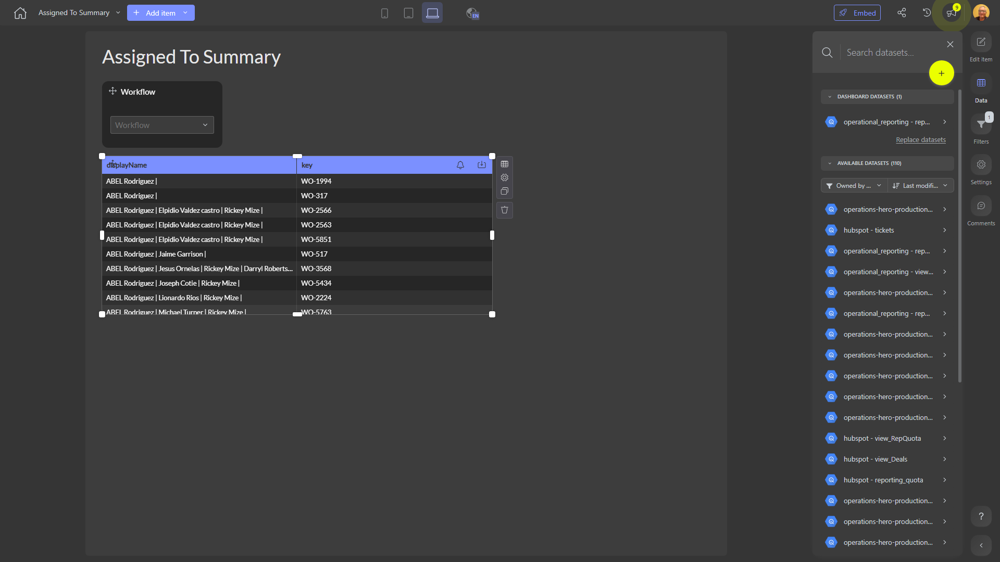

# Assigned To Summary

**Collections:** None

## Screenshot

## Description

The "Assigned To Summary" dashboard provides an overview of work assignments and the status of tasks or projects across an organization. This dashboard is likely used by managers, team leads, or project coordinators to understand the distribution of work and monitor progress.

The dashboard contains three dropdown filters that allow users to select and view data based on different "Workflow" categories. These filters likely correspond to different business processes, projects, or teams.

Underneath the filters, the dashboard displays three regular data tables that present detailed information about the work assignments. These tables may show metrics such as the number of tasks, their current status, the assigned employees, and any relevant deadlines or due dates.

By allowing users to filter the data by different workflows, this dashboard enables stakeholders to analyze work allocation, identify any bottlenecks or imbalances, and track the overall progress of the organization's initiatives. This information can help managers make informed decisions about resource allocation, workload distribution, and process improvements.

The dashboard is connected to a single dataset, and it likely pulls data from a central system that tracks work assignments, task statuses, and employee information. This centralized view can provide valuable insights to help optimize productivity and ensure timely completion of important tasks and projects.

Overall, the "Assigned To Summary" dashboard is a crucial tool for managers and team leads to maintain visibility into the organization's work, identify areas for improvement, and make data-driven decisions to enhance overall productivity and performance.

## AI-Generated Summary

The "Assigned To Summary" dashboard provides an at-a-glance view of work assignments and task progress across different workflows within an organization. This dashboard is likely used by managers, team leads, and project coordinators to understand how work is distributed, identify potential bottlenecks, and monitor the overall progress of key initiatives. By allowing users to filter the data by different workflow categories, the dashboard enables stakeholders to analyze workload, track deadlines, and make informed decisions about resource allocation and process improvements. This centralized view of work assignments and statuses can help optimize productivity and ensure timely completion of important tasks and projects.

### Tags

`work management` `task tracking` `resource allocation` `workflow analysis` `project management`

---

*Generated on 2026-01-29 12:46:25 by Luzmo API Tools*