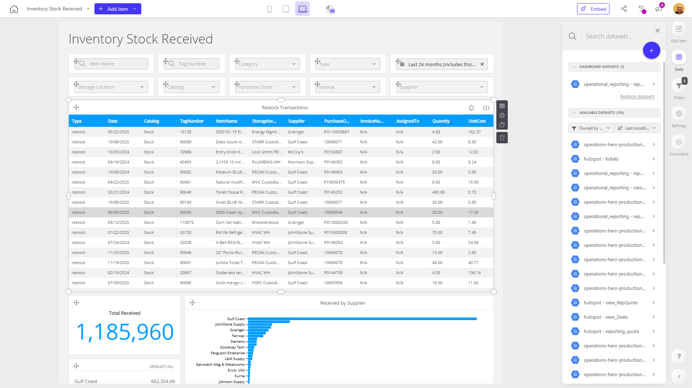

# Inventory Stock Received

**Collections:** Production Dashboards

## Screenshot

## Description

The Inventory Stock Received dashboard provides a comprehensive view of the inventory items that have been received by the organization. This dashboard is likely to be used by inventory managers, supply chain professionals, and business analysts to monitor and analyze the incoming inventory.

The dashboard contains a variety of interactive components, including:

- Dropdown filters to allow users to narrow down the data by category code, item type, item number, tag number, and date range
- Search filters to enable quick look-up of specific items or transactions
- A regular table that displays the details of restock transactions
- An evolution number to show the total quantity of items received
- A bar chart to visualize the received items by supplier
- A slicer filter to rank the received items

With these components, users can easily explore the inventory data, identify trends, and gain insights into the organization's receiving process. They can quickly filter the data to focus on specific categories, item types, or time periods, and the dashboard provides a clear and concise summary of the overall inventory received.

This dashboard would be valuable for inventory management, supply chain optimization, and reporting purposes, helping the organization make informed decisions about their inventory levels, supplier performance, and restocking needs.

## AI-Generated Summary

The Inventory Stock Received dashboard provides a comprehensive view of the incoming inventory items for the organization. It allows inventory managers, supply chain professionals, and business analysts to monitor and analyze the receiving process by enabling them to filter the data by various criteria such as category code, item type, item number, tag number, and date range. The dashboard features interactive components like dropdown filters, search filters, a regular table displaying restock transaction details, an evolution number showing the total quantity received, a bar chart visualizing the received items by supplier, and a slicer filter to rank the received items. With this dashboard, users can easily explore the inventory data, identify trends, and gain insights to make informed decisions about inventory levels, supplier performance, and restocking needs, ultimately supporting inventory management, supply chain optimization, and reporting efforts.

### Tags

`inventory` `supply chain` `received items` `reporting` `analytics`

## Filters

This dashboard has **3 interactive filters**:

- **Filter 1** (slicer-filter)
- **Filter 2** (slicer-filter)
- **Filter 3** (slicer-filter)

---

*Generated on 2026-01-29 12:45:19 by Luzmo API Tools*