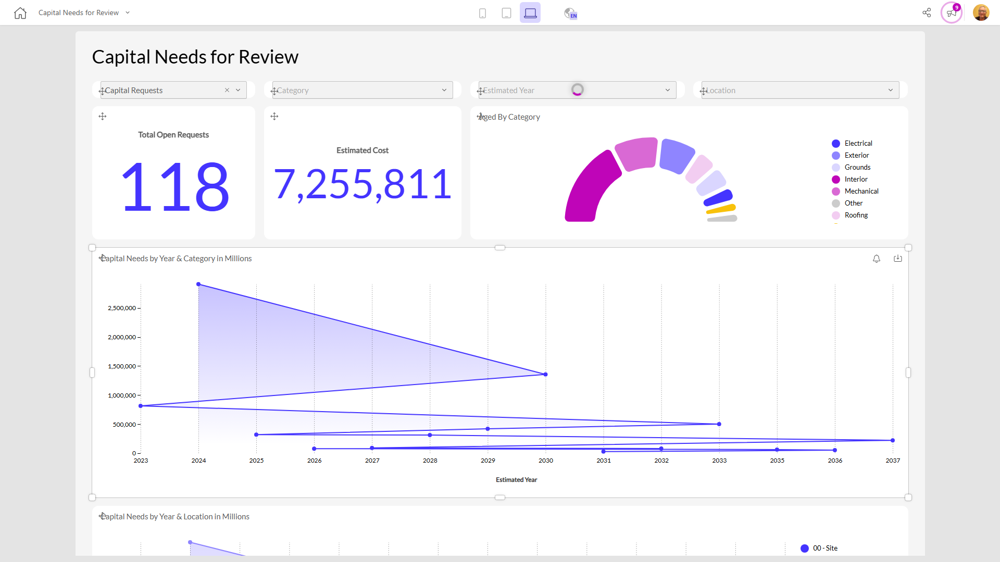

# Capital Needs for Review

**Collections:** Production Dashboards

## Screenshot

## AI-Generated Summary

This "Capital Needs for Review" dashboard provides a comprehensive view of an organization's capital projects and funding requirements. It allows users to track the total number of open requests, estimated costs, and funding needs by year, category, and location. The dashboard includes interactive filters, charts, and tables to help decision-makers prioritize capital investments, allocate resources, and manage the overall capital planning process. This dashboard would be valuable for executive leadership, finance teams, and project managers responsible for overseeing an organization's capital expenditures and infrastructure investments.

### Tags

`capital planning` `project management` `budget forecasting` `infrastructure investment` `resource allocation`

---

*Generated on 2026-01-29 12:48:53 by Luzmo API Tools*