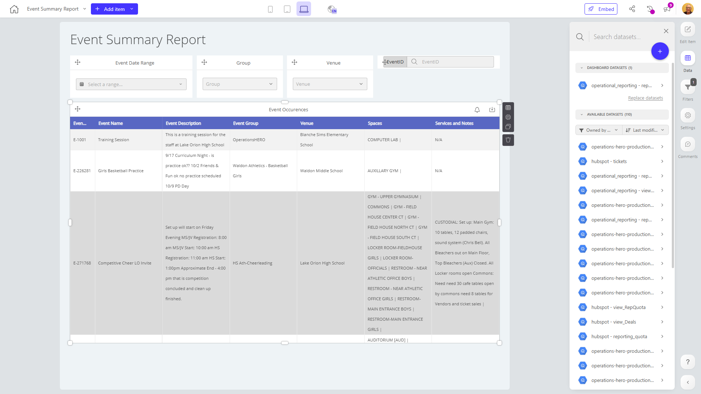

# Event Summary Report

**Collections:** Production Dashboards

## Screenshot

## Description

The Event Summary Report dashboard is a comprehensive tool designed to provide event organizers and managers with a detailed overview of their event activities. This dashboard allows users to analyze and track various aspects of their events, empowering them to make data-driven decisions and optimize their event planning and execution.

The dashboard features a total of 15 components, including dropdown filters, date filters, search filters, and regular tables. These components work together to enable users to explore and analyze event data from multiple perspectives.

The key features of the dashboard include:

1. Event Date Range: This filter allows users to select a specific date range to view event data within a specified timeframe.
2. Group: This dropdown filter enables users to group and analyze event data based on various categories, such as event type, location, or organizer.
3. Venue: This dropdown filter allows users to filter event data by the specific venue where the events took place.
4. Search Filter: This component provides a search functionality, enabling users to quickly find and analyze specific events or event-related information.
5. Event Occurrences: These regular table components display detailed information about the events, such as event name, date, location, attendance, and other relevant metrics.

The dashboard is connected to a single dataset, which likely contains the comprehensive event data required to generate the insights and analysis. Additionally, there is one parameter available, which may allow users to customize the dashboard's behavior or scope.

This Event Summary Report dashboard is a valuable tool for event organizers, managers, and stakeholders who need to track, analyze, and optimize their event activities. By providing a centralized and interactive view of event data, this dashboard can help users identify trends, uncover insights, and make informed decisions to improve the success and impact of their events.

## AI-Generated Summary

The Event Summary Report dashboard is a comprehensive tool that provides event organizers and managers with detailed insights into their event activities. This dashboard allows users to analyze and track various aspects of their events, such as event date, type, location, and attendance, empowering them to make data-driven decisions and optimize their event planning and execution. With its rich set of filters and interactive tables, the dashboard enables users to explore event data from multiple perspectives, identify trends, and uncover valuable insights that can help improve the success and impact of their events.

### Tags

`event management` `event analytics` `event planning` `data-driven decisions` `business intelligence`

---

*Generated on 2026-01-29 12:46:05 by Luzmo API Tools*