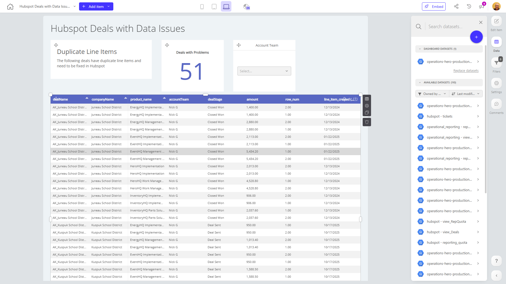

# Hubspot Deals with Data Issues

**Collections:** None

## Screenshot

## Description

This dashboard, titled "Hubspot Deals with Data Issues," is designed to provide sales and account management teams with insights into their deals and any potential data quality issues. The dashboard contains 12 components, including text boxes, evolution-number charts, dropdown filters, and regular tables.

The three text components likely provide contextual information, headings, or explanations to guide the user through the dashboard. The three evolution-number charts, titled "Deals with Problems," track the trends and changes in deals with data-related issues over time. The three dropdown filters, labeled "Account Team," allow users to segment and analyze the data by different account teams or sales representatives.

The three regular tables likely display detailed information about the deals, such as deal size, stage, and status, as well as any associated data quality problems or issues. These tables enable users to dive deeper into the underlying data and understand the nature of the data quality concerns.

Overall, this dashboard serves as a comprehensive solution for sales and account management teams to monitor their deals, identify any data-related problems, and potentially take action to address those issues. By providing a combination of high-level trends, filtering capabilities, and detailed deal-level information, the dashboard helps users make more informed decisions and maintain data integrity within their Hubspot sales pipeline.

## AI-Generated Summary

This dashboard provides sales and account management teams with comprehensive insights into their Hubspot deals, enabling them to identify and address any potential data quality issues. By monitoring trends in deals with problems, segmenting data by account teams, and accessing detailed deal-level information, users can gain a holistic understanding of their sales pipeline and ensure the integrity of their Hubspot data. This dashboard empowers teams to make more informed decisions, maintain data quality, and ultimately drive better sales outcomes.

### Tags

`sales` `data quality` `deal tracking` `account management` `hubspot`

---

*Generated on 2026-01-29 12:48:24 by Luzmo API Tools*