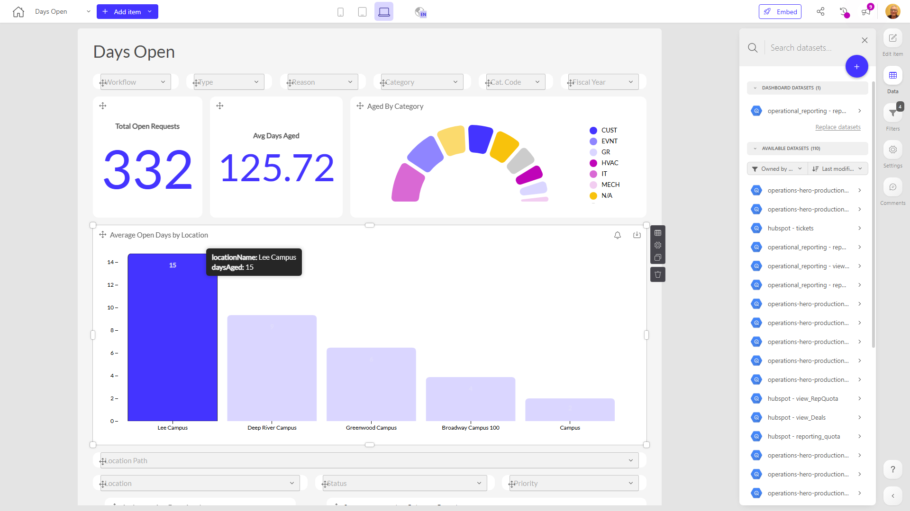

# Days Open

**Collections:** HeroHQ Dashboards, Production Dashboards

## Screenshot

## Description

This "Days Open" dashboard appears to be a comprehensive reporting tool for tracking and analyzing open requests or tasks across an organization. With a total of 72 components, it provides a wide range of visualizations and interactive filters to help users gain insights into the status and aging of open requests.

The dashboard includes several key features:

1. **Filtering and Search**: There are 30 dropdown-filter components that allow users to refine the data by various criteria, such as location, category, assignee, and more. This enables users to quickly slice and dice the data to focus on specific areas of interest.

2. **Metrics and KPIs**: The dashboard includes 6 evolution-number components that display important metrics, such as the total number of open requests. These high-level KPIs provide a quick overview of the overall performance.

3. **Detailed Analysis**: The dashboard offers more in-depth analysis through components like a donut chart showing the "Aged By Category", a column chart for "Average Open Days by Location", and a pivot table. These allow users to explore the open request data from different angles and uncover deeper insights.

4. **Date Range Control**: A date-filter component gives users the ability to adjust the time period being analyzed, enabling them to track trends and changes over time.

This dashboard is likely used by managers, team leads, and operational personnel who need to monitor and optimize the open request handling process. It provides a centralized view of key metrics, allows for targeted investigations, and facilitates data-driven decision-making to improve overall request resolution efficiency and customer satisfaction.

## AI-Generated Summary

This comprehensive "Days Open" dashboard provides a powerful reporting and analytics solution for tracking and managing open requests or tasks across an organization. It offers a wide range of interactive filters, visualizations, and key metrics to help managers, team leads, and operational personnel monitor the status, aging, and resolution of open items. The dashboard allows users to quickly identify areas of concern, understand trends, and make data-driven decisions to optimize the open request handling process and improve customer satisfaction.

### Tags

`open request management` `operations reporting` `task tracking` `performance optimization` `customer service`

## Filters

This dashboard has **3 interactive filters**:

- **Filter 1** (slicer-filter)
- **Filter 2** (slicer-filter)
- **Filter 3** (slicer-filter)

---

*Generated on 2026-01-29 12:47:55 by Luzmo API Tools*