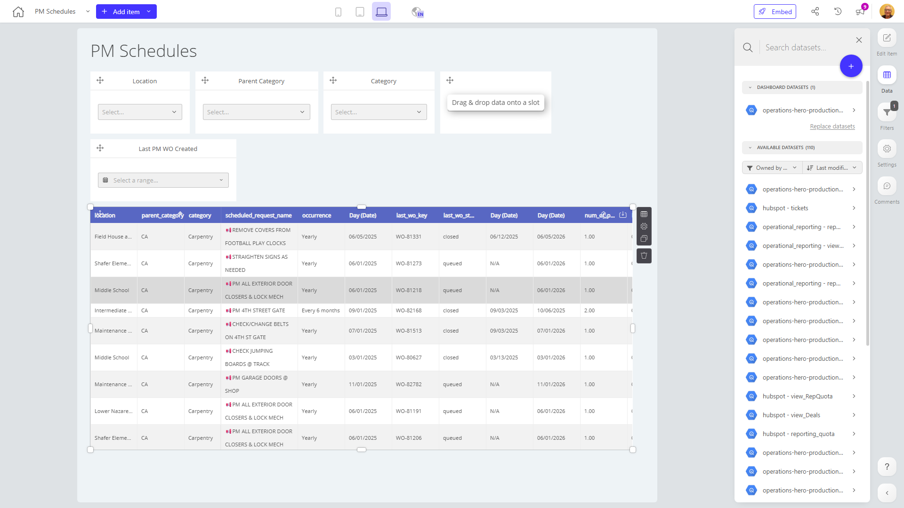

# PM Schedules

**Collections:** None

## Screenshot

## Description

The "PM Schedules" dashboard provides a comprehensive view of the company's planned maintenance (PM) schedules and work orders (WOs). This dashboard is likely used by maintenance managers, operations leaders, and other stakeholders who need to oversee and manage the organization's preventive maintenance activities.

The dashboard includes several key components:

1. Dropdown filters: These allow users to easily filter the data by location, parent category, and specific category. This enables them to focus on specific areas of the business or asset types.

2. Date filters: Users can select a date range to view PM work orders created during a specific period. This helps them understand historical trends and plan future maintenance activities.

3. Regular tables: The dashboard displays detailed information about PM work orders in a tabular format. These tables likely include key details such as work order status, asset information, and maintenance activities performed.

Together, these components provide a comprehensive view of the company's PM schedule and work order management. Users can quickly identify where maintenance is planned, monitor upcoming activities, and analyze historical trends to optimize their preventive maintenance program.

This dashboard would be particularly valuable for maintenance managers and operations leaders who need to ensure that critical assets are properly maintained, minimize unplanned downtime, and optimize the allocation of maintenance resources across the organization.

## AI-Generated Summary

The "PM Schedules" dashboard provides a comprehensive view of the company's planned maintenance (PM) schedules and work orders (WOs). This dashboard is likely used by maintenance managers, operations leaders, and other stakeholders who need to oversee and manage the organization's preventive maintenance activities. The dashboard allows users to filter the data by location, parent category, and specific category, as well as view historical trends by selecting a date range. This enables them to quickly identify where maintenance is planned, monitor upcoming activities, and analyze historical trends to optimize their preventive maintenance program. The detailed information displayed in the tables, such as work order status, asset information, and maintenance activities performed, helps users ensure critical assets are properly maintained, minimize unplanned downtime, and optimize the allocation of maintenance resources across the organization.

### Tags

`preventive maintenance` `work order management` `operations` `asset management` `maintenance scheduling`

---

*Generated on 2026-01-29 12:46:49 by Luzmo API Tools*