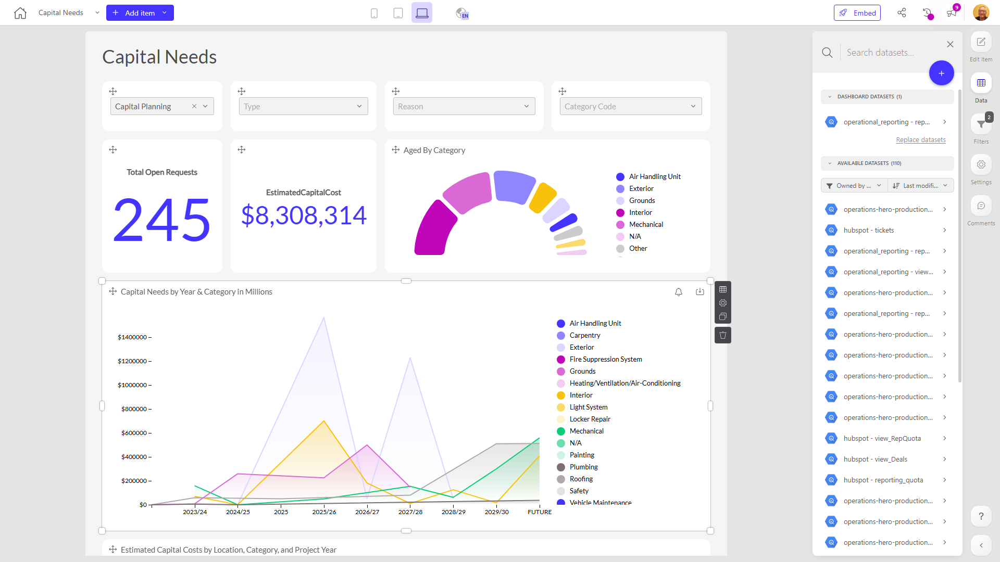

# Capital Needs

**Collections:** Client Dashboards, Production Dashboards

## Screenshot

## Description

The "Capital Needs" dashboard provides a comprehensive view of an organization's capital investment requirements and project pipeline. This dashboard is likely used by finance, facilities, and capital planning teams to understand the current status, trends, and projected costs of planned capital projects.

The dashboard features a variety of components that allow users to:

1. Easily filter and search for specific capital projects using a set of dropdown filters.
2. Monitor key metrics like the total number of open capital requests and the current backlog cost.
3. Analyze the age and category breakdown of capital projects through a donut chart.
4. Visualize the capital needs by year and category, as well as by year and location, using line charts.
5. Dive into the details of estimated capital costs, with pivot tables that break down the information by location, category, and project year.
6. Access a comprehensive data table with the full list of capital projects and their details.

This dashboard likely serves as a central hub for capital planning and budgeting, enabling stakeholders to make informed decisions about resource allocation, project prioritization, and long-term financial planning. The combination of filters, visualizations, and detailed data tables allows users to quickly identify trends, analyze cost drivers, and plan for future capital needs.

## AI-Generated Summary

The "Capital Needs" dashboard provides a comprehensive view of an organization's capital investment requirements and project pipeline. This dashboard is designed for finance, facilities, and capital planning teams to understand the current status, trends, and projected costs of planned capital projects. Users can easily filter and search for specific projects, monitor key metrics like total open requests and backlog cost, analyze the age and category breakdown of projects, and visualize capital needs by year, category, and location. The detailed data tables and pivot tables allow users to dive into the specifics of estimated capital costs, enabling informed decision-making around resource allocation, project prioritization, and long-term financial planning.

### Tags

`capital planning` `facilities management` `financial planning` `project management` `resource allocation`

---

*Generated on 2026-01-29 12:48:04 by Luzmo API Tools*