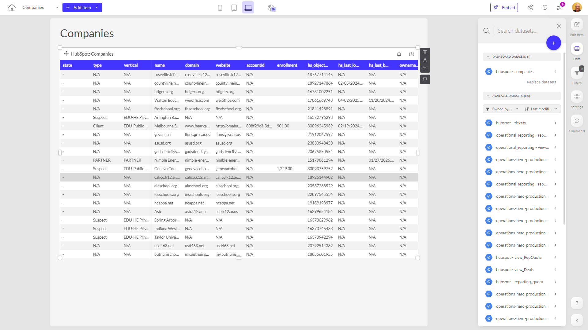

# Companies

**Collections:** None

## Screenshot

## Description

This dashboard provides an overview of the companies that are being tracked or managed within the system. It consists of three regular table components, all of which display information about the "Companies" data.

The main purpose of this dashboard is to give users a centralized view of the companies that are of interest to the business. This could be helpful for sales teams, account managers, or operations personnel who need to stay up-to-date on the companies they work with, monitor their status, and potentially take action based on the information presented.

Some of the key questions this dashboard likely answers include:
- What are the companies currently in our system or under management?
- What are the core details about each company (e.g. name, location, industry, etc.)?
- What is the current status or activity level for each company?

By consolidating all of this company information into a single dashboard, users can quickly scan the data, identify any important updates or changes, and drill into the details of specific companies as needed. This streamlines access to critical business information and supports more informed decision-making.

Overall, this dashboard serves as a central hub for monitoring and managing the companies that are core to the organization's operations and objectives. It provides a comprehensive, at-a-glance view that can benefit a variety of stakeholders across the business.

## AI-Generated Summary

This dashboard provides an overview of the companies that are being tracked or managed within the organization. It consolidates key details about each company, including their name, location, industry, and current status or activity level. By presenting this information in a centralized view, the dashboard helps sales teams, account managers, and operations personnel stay up-to-date on the companies they work with and monitor their progress. The comprehensive data can support more informed decision-making and ensure the business is aligned with its core customers and partners.

### Tags

`companies` `customers` `partners` `operations` `management`

---

*Generated on 2026-01-29 11:50:26 by Luzmo API Tools*