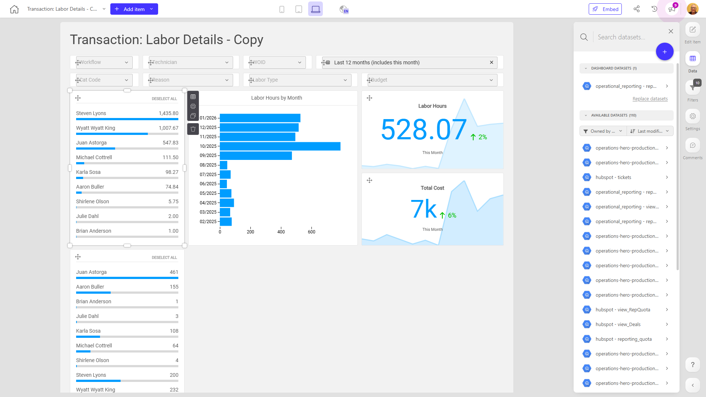

# Transaction: Labor Details - Copy

**Collections:** None

## Screenshot

## Description

This "Transaction: Labor Details" dashboard provides a comprehensive view of labor-related transactions and metrics for a business. It is likely used by operations managers, finance teams, or project leaders to track and analyze labor costs and utilization.

The dashboard contains a variety of components that allow users to filter, view, and analyze labor data:

- Dropdown filters let users select specific types of transactions, technicians, work orders (WOIDs), dates, and suppliers/vendors to focus the analysis.
- Pivot tables break down labor hours by location, providing detailed insights into how labor is being utilized across different sites or departments.
- Bar charts and evolution numbers visualize labor hours over time, highlighting trends and performance.
- Slicer filters allow users to quickly segment the data by different ranking criteria.
- A detailed transactions table lists out individual labor entries, providing the underlying detail.

Together, these components enable users to answer key questions such as:
- How are labor hours and costs trending over time?
- Which technicians, work orders, or suppliers are driving the highest labor usage?
- Where are the largest concentrations of labor hours, and how does this vary by location?
- What are the details of individual labor transactions that make up the overall metrics?

This dashboard likely serves as a central hub for labor management, allowing operations and finance teams to monitor, analyze, and optimize their labor-related activities and costs. The depth of information and analysis capabilities make it a valuable tool for data-driven decision making.

## AI-Generated Summary

This "Transaction: Labor Details" dashboard provides a comprehensive view of labor-related transactions and metrics for a business. It is likely used by operations managers, finance teams, or project leaders to track and analyze labor costs and utilization. The dashboard contains a variety of components that allow users to filter, view, and analyze labor data, including dropdown filters, pivot tables, bar charts, evolution numbers, slicer filters, and a detailed transactions table. Together, these components enable users to answer key questions about labor hours and costs, labor utilization by technician and location, and the details of individual labor transactions. This dashboard serves as a central hub for labor management, allowing teams to monitor, analyze, and optimize their labor-related activities and costs.

### Tags

`labor management` `operations analytics` `finance reporting` `project management` `cost optimization`

## Filters

This dashboard has **6 interactive filters**:

- **Filter 1** (slicer-filter)
- **Filter 2** (slicer-filter)
- **Filter 3** (slicer-filter)
- **Filter 4** (slicer-filter)
- **Filter 5** (slicer-filter)
- **Filter 6** (slicer-filter)

---

*Generated on 2026-01-29 12:45:24 by Luzmo API Tools*