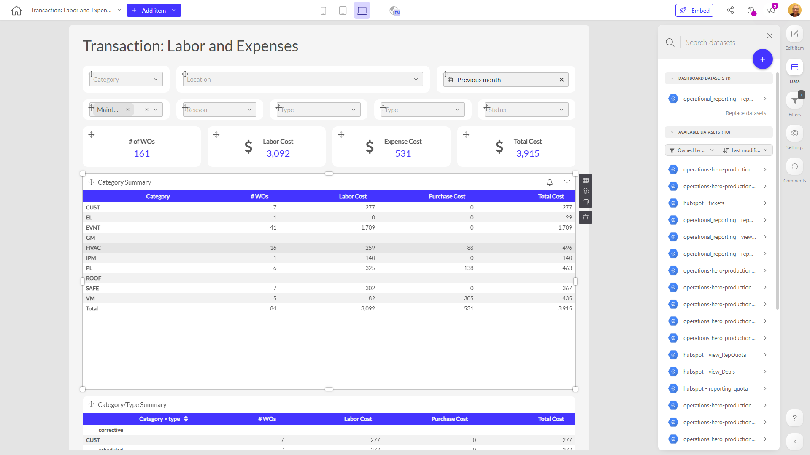

# Transaction: Labor and Expenses

**Collections:** Client Dashboards, Production Dashboards

## Screenshot

## Description

This "Transaction: Labor and Expenses" dashboard provides a comprehensive view of an organization's labor and expense transactions. It is likely used by finance, operations, and management teams to track, analyze, and gain insights into the organization's spending and resource utilization.

The dashboard contains a variety of components that enable users to:

1. Filter and segment the data by various criteria such as location, category, work order, and date range using the numerous dropdown filters and date filters.

2. Monitor key metrics and trends over time using the evolution number components that display measures like the number of transactions, labor hours, and expenses.

3. Analyze transaction data in more detail through pivot tables that summarize information by category, type, and location.

4. Drill down into individual work order details using the regular table components.

The dashboard pulls data from a single connected dataset and allows users to adjust parameters to customize their view. This provides a centralized, interactive platform for stakeholders to understand labor costs, monitor spending patterns, identify opportunities for optimization, and make more informed business decisions.

Overall, this dashboard serves as a valuable tool for financial management, operational efficiency, and strategic planning within the organization.

## AI-Generated Summary

This "Transaction: Labor and Expenses" dashboard provides a comprehensive view of an organization's labor and expense transactions. It is designed to help finance, operations, and management teams track, analyze, and gain insights into the organization's spending and resource utilization. Users can filter and segment the data by various criteria, monitor key metrics and trends over time, analyze transaction data in detail, and drill down into individual work order details. This centralized, interactive platform enables stakeholders to understand labor costs, monitor spending patterns, identify opportunities for optimization, and make more informed business decisions.

### Tags

`financial management` `operational efficiency` `cost optimization` `resource utilization` `strategic planning`

---

*Generated on 2026-01-29 12:48:32 by Luzmo API Tools*