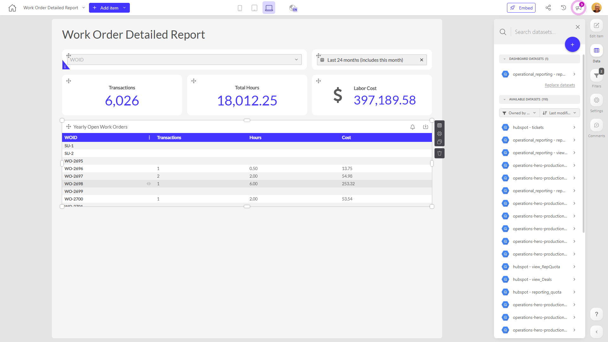

# Work Order Detailed Report

**Collections:** Production Dashboards

## Screenshot

## Description

The "Work Order Detailed Report" dashboard provides a comprehensive view of the company's open work orders, helping managers and operations teams track and analyze this important aspect of the business.

This dashboard is likely used by field service managers, maintenance supervisors, and other professionals responsible for overseeing the company's work order processes. It allows them to:

1. Filter work order data by various criteria, such as specific search terms and date ranges, using the provided dropdown filters and date filters.

2. Analyze trends in the number of open work orders over time, using the evolution-number components that display key metrics like the total number of transactions.

3. Dive deeper into the yearly trends of open work orders through the pivot-table components, which likely show breakdowns by factors like work order status, priority, or other relevant dimensions.

The dashboard draws data from a single connected dataset, and it appears to have one parameter that can be used to adjust the displayed information.

Overall, this dashboard gives stakeholders a detailed, data-driven view of the company's work order status and history, enabling them to make more informed decisions about resource allocation, process improvements, and customer service.

## AI-Generated Summary

The "Work Order Detailed Report" dashboard provides a comprehensive view of the company's open work orders, helping managers and operations teams track and analyze this important aspect of the business. It allows users to filter work order data by various criteria, analyze trends in the number of open work orders over time, and dive deeper into yearly trends through interactive pivot tables. This dashboard gives stakeholders a detailed, data-driven view of the company's work order status and history, enabling them to make more informed decisions about resource allocation, process improvements, and customer service.

### Tags

`work orders` `field service` `maintenance` `operations` `resource management`

---

*Generated on 2026-01-29 12:43:04 by Luzmo API Tools*