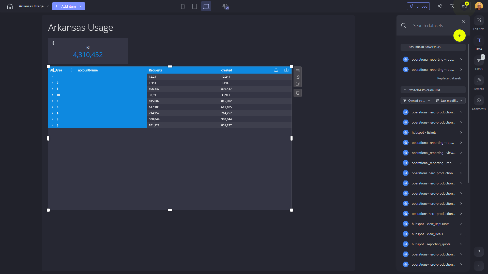

# Arkansas Usage

**Collections:** None

## Screenshot

## Description

The Arkansas Usage dashboard provides a comprehensive view of key usage metrics and trends for the state of Arkansas. This dashboard is likely used by state government officials, policymakers, and program managers to monitor and analyze various aspects of Arkansas' performance and resource utilization.

The dashboard consists of six components, including three one-number components and three pivot table components. The one-number components likely display high-level, summarized metrics such as total population, economic output, or healthcare utilization. The pivot table components, on the other hand, provide more detailed, multidimensional views of the data, enabling users to explore and analyze usage patterns, trends, and comparisons across different dimensions (e.g., geographic regions, demographic groups, time periods).

The dashboard is connected to two datasets, which suggests that it draws data from multiple sources to provide a holistic perspective on Arkansas' usage and performance. This integration of data from various sources allows users to gain a comprehensive understanding of the state's overall situation and make informed decisions based on the insights provided.

Overall, the Arkansas Usage dashboard serves as a valuable tool for state government officials, policymakers, and program managers to monitor, analyze, and track the usage and performance of various aspects of Arkansas' economy, social services, and infrastructure. By providing a centralized, data-driven view of key metrics and trends, this dashboard supports data-informed decision-making and helps drive strategic initiatives to improve the well-being and development of the state.

## AI-Generated Summary

The Arkansas Usage dashboard provides state government officials, policymakers, and program managers with a comprehensive view of key usage metrics and trends for the state of Arkansas. The dashboard integrates data from multiple sources to deliver high-level summaries and detailed, multidimensional analyses across various aspects of the state's economy, social services, and infrastructure. By monitoring population, economic output, healthcare utilization, and other critical metrics, users can gain valuable insights to support data-driven decision-making and drive strategic initiatives that improve the overall well-being and development of Arkansas.

### Tags

`arkansas government` `usage analytics` `state performance` `policy decision-making` `program management`

---

*Generated on 2026-01-29 12:42:14 by Luzmo API Tools*