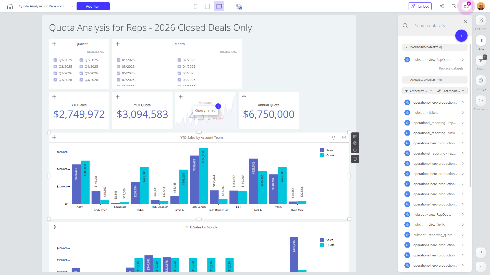

# Quota Analysis for Reps - 2026 Closed Deals Only 

**Collections:** None

## Screenshot

## Description

This dashboard provides a comprehensive analysis of sales quotas and performance for the company's sales representatives in 2026. It is designed to help sales managers and executives track and understand their team's sales performance against their quotas.

The dashboard features a variety of components that display key metrics and insights:

- Slicer filters allow users to analyze data by quarter and month, enabling them to focus on specific time periods.
- Evolution number components show the year-to-date (YTD) quota, actual sales, and the percentage of quota achieved. This gives users a high-level view of overall sales performance.
- Column charts visualize YTD sales by account team and by month, helping identify top-performing teams and trends over time.
- Pivot tables provide detailed breakdowns of sales data, allowing users to analyze performance by various dimensions such as account team, product, and region.
- A bullet chart gives a visual representation of YTD performance against the sales quota.

Together, these components enable sales leaders to closely monitor their team's progress, identify areas of strength and opportunity, and make informed decisions to optimize sales strategies and achieve their annual targets. This dashboard would be particularly useful for regional sales managers, the sales leadership team, and executives responsible for overall sales performance.

## AI-Generated Summary

This dashboard provides a comprehensive analysis of sales quotas and performance for the company's sales representatives in 2026. It enables sales managers and executives to closely monitor their team's progress, identify areas of strength and opportunity, and make informed decisions to optimize sales strategies and achieve their annual targets. The dashboard features key metrics and insights, including year-to-date quota, actual sales, and percentage of quota achieved, as well as visualizations of sales performance by account team and month. Users can analyze the data by quarter and month, allowing them to focus on specific time periods. This dashboard would be particularly useful for regional sales managers, the sales leadership team, and executives responsible for overall sales performance.

### Tags

`sales` `quota` `performance` `analytics` `reporting`

## Filters

This dashboard has **6 interactive filters**:

- **Filter 1** (slicer-filter)
- **Filter 2** (slicer-filter)
- **Filter 3** (slicer-filter)
- **Filter 4** (slicer-filter)
- **Filter 5** (slicer-filter)
- **Filter 6** (slicer-filter)

---

*Generated on 2026-01-29 12:48:07 by Luzmo API Tools*