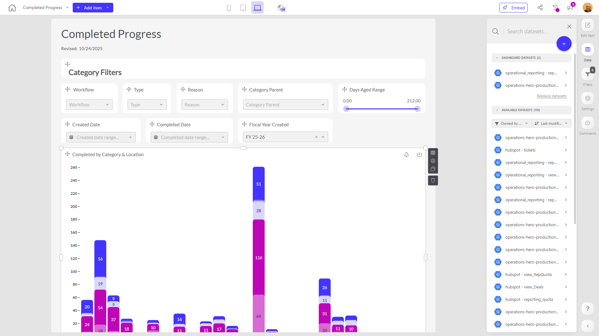

# Completed Progress

**Collections:** Client Dashboards, Production Dashboards

## Screenshot

## Description

The "Completed Progress" dashboard appears to be a comprehensive reporting tool that tracks and analyzes the status and details of completed work orders or tasks. Based on the component types and named elements, this dashboard likely provides the following key insights:

1. Filtering and segmentation capabilities: The dashboard offers a robust set of filters, including dropdown menus for Workflow, Type, Reason, Category Parent, and Fiscal Year Created. It also includes a slider filter for Days Aged Range and date filters for Created Date and Completed Date. These filtering options allow users to slice and dice the data to gain a granular understanding of the completed work orders.

2. Completed work order analysis: The dashboard includes several visualizations to analyze the completed work orders, such as a column chart showing "Completed by Category & Location" and a line chart for "Completed Work Orders by Category". These charts provide insights into the volume, distribution, and trends of completed work across different categories and locations.

3. Detailed work order information: The dashboard likely displays detailed information about each completed work order, such as the Workflow, Type, Reason, Category Parent, and the time between the Created Date and Completed Date.

This dashboard would be valuable for teams responsible for managing and tracking the completion of various work orders or tasks, such as maintenance, operations, or project management. It enables users to monitor the progress, identify bottlenecks, and optimize the completion process. The dashboard's flexibility in filtering and segmentation allows decision-makers to drill down into the data and gain a comprehensive understanding of the completed work, which can inform process improvements and resource allocation.

## AI-Generated Summary

The "Completed Progress" dashboard is a comprehensive reporting tool that tracks and analyzes the status and details of completed work orders or tasks. It provides a robust set of filtering options, including workflow, type, reason, category, fiscal year, and date ranges, allowing users to slice and dice the data to gain a granular understanding of the completed work. The dashboard includes visualizations that offer insights into the volume, distribution, and trends of completed work across different categories and locations. This dashboard would be valuable for teams responsible for managing and tracking the completion of various work orders or tasks, as it enables them to monitor progress, identify bottlenecks, and optimize the completion process.

### Tags

`work orders` `task management` `operations` `progress tracking` `data analysis`

## Filters

This dashboard has **3 interactive filters**:

- **Filter 1** (slicer-filter)
- **Filter 2** (slicer-filter)
- **Filter 3** (slicer-filter)

---

*Generated on 2026-01-29 12:47:37 by Luzmo API Tools*