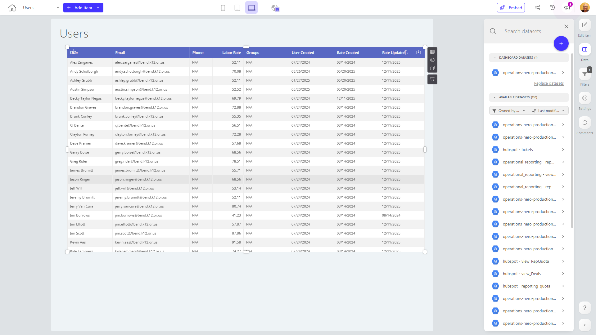

# Users

**Collections:** Production Dashboards

## Screenshot

## Description

This "Users" dashboard provides a comprehensive overview of user data and activity for the organization. The dashboard consists of three regular tables, each likely displaying different user-related metrics or information.

Without a specific description provided, we can infer that this dashboard is designed to help business stakeholders, such as product managers, customer support teams, or marketing analysts, gain insights into their user base. The regular tables likely display data points like user demographics, user behavior and engagement, or user support and service metrics.

The dashboard is connected to a single dataset, which could contain various user-related information, and it includes one parameter, potentially allowing users to filter or segment the data in specific ways.

Overall, this dashboard serves as a centralized hub for understanding the organization's user population. It likely answers key questions around user characteristics, usage patterns, and service interactions. The stakeholders who would find this dashboard most valuable are those responsible for managing, supporting, or optimizing the user experience, such as product, customer success, or operations teams.

## AI-Generated Summary

The "Users" dashboard provides a comprehensive overview of user data and activity for the organization. This dashboard includes three regular tables that likely display key user-related metrics and information, such as user demographics, behavior, engagement, support interactions, and service metrics. The dashboard serves as a centralized hub for understanding the organization's user population, helping business stakeholders like product managers, customer support teams, and marketing analysts gain valuable insights. With the ability to filter and segment the data, users can easily analyze user characteristics, usage patterns, and service interactions to optimize the user experience and make informed business decisions.

### Tags

`user analytics` `customer insights` `user management` `user experience` `business intelligence`

---

*Generated on 2026-01-29 11:55:22 by Luzmo API Tools*