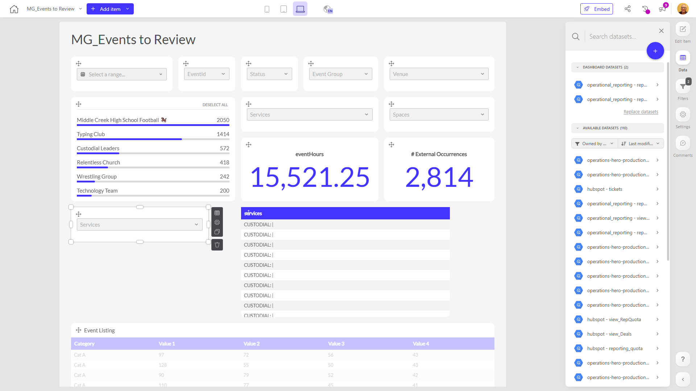

# MG_Events to Review

**Collections:** Production Dashboards

## Screenshot

## Description

The "MG_Events to Review" dashboard provides a comprehensive overview of upcoming events that need to be reviewed and managed. This dashboard is likely used by event planners, venue managers, and other stakeholders responsible for organizing and executing events.

The dashboard includes a variety of components that allow users to filter, analyze, and track key information about upcoming events:

- Dropdown filters for event status, event group, venue, internal events, and more, enabling users to quickly narrow down the event data to focus on specific areas of interest.
- Date filters to view events based on their start date.
- Slicer filters to analyze event rank or other metrics.
- Evolution number components that track metrics like event hours and external event occurrences over time.
- Multiple regular tables that provide detailed listings of events, services, spaces, and other relevant information.

By combining these various filter, visualization, and data display components, the dashboard empowers users to:

- Understand the current status and progress of upcoming events
- Identify potential issues or areas that need attention (e.g., events with low attendance, events without necessary services booked)
- Analyze trends and patterns in event data to inform future planning and decision-making
- Collaborate and coordinate event management across different teams and stakeholders

This dashboard is likely used by event managers, venue coordinators, and other key personnel responsible for ensuring the successful execution of the organization's events. It provides a centralized, data-driven view to help them effectively review, monitor, and manage the full event lifecycle.

## AI-Generated Summary

The "MG_Events to Review" dashboard provides a centralized, data-driven view to help event managers, venue coordinators, and other stakeholders effectively review, monitor, and manage the full lifecycle of upcoming events. This dashboard empowers users to understand the current status and progress of events, identify potential issues or areas that need attention, analyze trends and patterns, and collaborate across different teams. By combining various filter, visualization, and data display components, users can quickly narrow down event data, track key metrics, and make informed decisions to ensure the successful execution of the organization's events.

### Tags

`event management` `event planning` `venue management` `performance monitoring` `data-driven decision making`

## Filters

This dashboard has **3 interactive filters**:

- **Filter 1** (slicer-filter)
- **Filter 2** (slicer-filter)
- **Filter 3** (slicer-filter)

---

*Generated on 2026-01-29 12:46:33 by Luzmo API Tools*