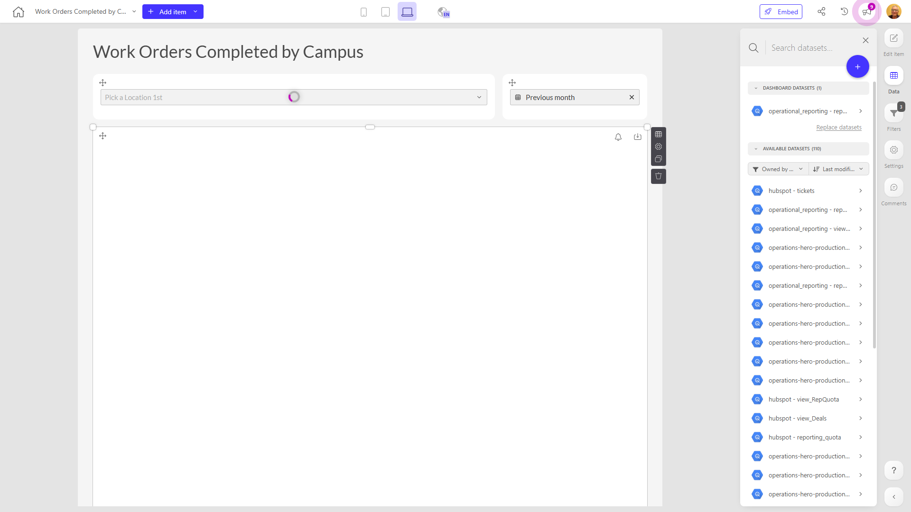

# Work Orders Completed by Campus

**Collections:** Production Dashboards

## Screenshot

## Description

The "Work Orders Completed by Campus" dashboard provides a comprehensive view of work order data across an organization's various campuses. This dashboard is designed to help facility managers, campus administrators, and operations teams monitor and analyze the completion of work orders at different campus locations.

The dashboard consists of nine components, including three dropdown filters, three date filters, and three regular tables. These components work together to allow users to:

1. Search and select specific campuses to focus on.
2. Filter the work order data by date ranges, enabling analysis of trends over time.
3. View detailed information about the work orders completed at each campus in a tabular format.

The dashboard's main purpose is to answer the following key questions:
- How many work orders have been completed at each campus?
- Are there any patterns or trends in the volume of work orders completed over time?
- Are there any differences in work order completion rates between campuses?

By providing this level of visibility and insights, the "Work Orders Completed by Campus" dashboard empowers users to identify areas for improvement, optimize resource allocation, and ensure consistent service delivery across the organization's campuses. This information can be valuable for campus maintenance planning, budget forecasting, and overall operational efficiency.

## AI-Generated Summary

The "Work Orders Completed by Campus" dashboard provides facility managers, campus administrators, and operations teams with a comprehensive view of work order completion data across an organization's campuses. This dashboard enables users to monitor work order trends, identify performance differences between campuses, and optimize resource allocation to ensure consistent service delivery. Users can filter the data by campus and date range to gain insights into work order volumes and completion patterns, supporting data-driven decision-making for campus maintenance planning and operational efficiency.

### Tags

`work orders` `campus management` `facilities management` `operational efficiency` `performance monitoring`

---

*Generated on 2026-01-29 12:42:59 by Luzmo API Tools*