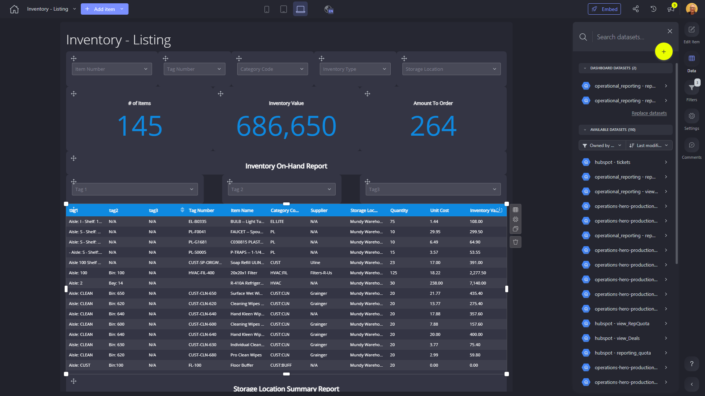

# Inventory - Listing

**Collections:** Client Dashboards, Production Dashboards

## Screenshot

## Description

This Inventory - Listing dashboard provides a comprehensive view of a business's inventory management, catering to the needs of inventory managers, purchasing agents, and operations personnel.

The dashboard features a variety of components that allow users to:

1. Quickly filter and search the inventory by key attributes such as Item Number, Tag Number, Category Code, Type, and Storage Location.
2. Monitor critical inventory metrics like Number of Items, Inventory Value, and Amount to Order, enabling informed purchasing decisions.
3. Gain insights into inventory trends and patterns through the Inventory Summary Report and Storage Location Summary pivot table.
4. Identify items that need to be re-ordered based on the Inventory Re-Order Report.

The dashboard integrates data from two connected datasets, providing a centralized and up-to-date view of the company's inventory. This allows users to make informed decisions, optimize inventory levels, and ensure the efficient management of the business's assets.

Overall, this dashboard serves as a valuable tool for inventory management, enabling users to effectively monitor, analyze, and control the company's inventory, ultimately supporting business growth and operational efficiency.

## AI-Generated Summary

This Inventory - Listing dashboard provides a comprehensive view of a business's inventory management, catering to the needs of inventory managers, purchasing agents, and operations personnel. It enables users to quickly filter and search the inventory, monitor critical inventory metrics, gain insights into inventory trends, and identify items that need to be re-ordered. The dashboard integrates data from two connected datasets, providing a centralized and up-to-date view of the company's inventory, allowing users to make informed decisions, optimize inventory levels, and ensure the efficient management of the business's assets. This dashboard serves as a valuable tool for inventory management, supporting business growth and operational efficiency.

### Tags

`inventory management` `asset management` `operations` `purchasing` `business intelligence`

---

*Generated on 2026-01-29 12:42:49 by Luzmo API Tools*