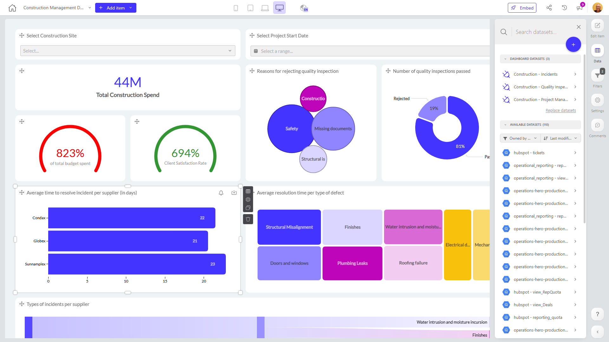

# Construction Management Dashboard Template - Copy

**Collections:** None

## Screenshot

## Description

This Construction Management Dashboard Template is designed to provide construction project managers and executives with a comprehensive view of key metrics and insights to effectively oversee ongoing construction projects. The dashboard consolidates essential information across three connected datasets, empowering users to monitor critical aspects of construction management, including incident response, project spend, and quality inspection processes.

The dashboard features a diverse set of 40 components, including a variety of charts, gauges, and filters, that enable users to:

1. Track overall construction spend and monitor project progress through a set of circular gauges.
2. Analyze the number of quality inspections passed and understand the reasons for rejected inspections using a donut chart and bubble chart.
3. Identify the types of incidents per supplier and the average time to resolve incidents per supplier using a sankey diagram and bar chart.
4. Explore the average resolution time per type of defect using a treemap visualization.
5. Easily filter and segment data by construction site and project start date using the provided selectbox and date filter components.

This dashboard serves as a valuable tool for construction managers, project leaders, and stakeholders, allowing them to quickly assess the health and performance of their construction projects, identify areas for improvement, and make informed decisions to ensure successful project delivery.

## AI-Generated Summary

The Construction Management Dashboard Template provides construction project managers and executives with a comprehensive view of key metrics and insights to effectively oversee ongoing construction projects. The dashboard consolidates essential information across three connected datasets, enabling users to monitor critical aspects of construction management, including incident response, project spend, and quality inspection processes. The diverse set of 40 components, including charts, gauges, and filters, allow users to track overall construction spend, analyze quality inspection results, identify incident trends per supplier, and explore resolution times for different types of defects. This dashboard serves as a valuable tool for construction leaders to quickly assess project health, identify areas for improvement, and make informed decisions to ensure successful project delivery.

### Tags

`construction management` `project oversight` `quality assurance` `incident response` `construction analytics`

---

*Generated on 2026-01-29 12:44:02 by Luzmo API Tools*