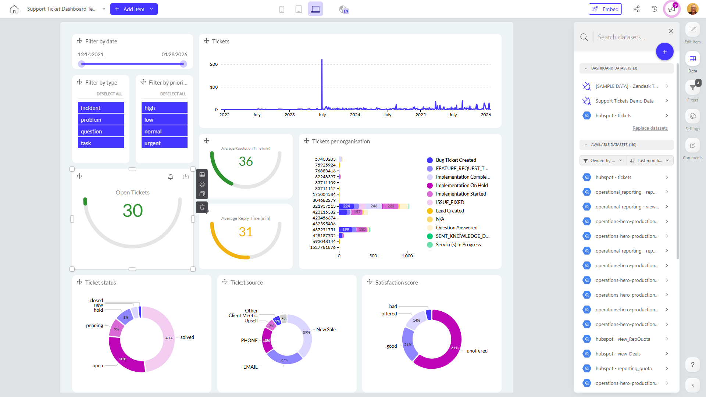

# Support Ticket Dashboard Template - Copy

**Collections:** None

## Screenshot

## Description

This Support Ticket Dashboard Template provides a comprehensive view of a company's customer support operations. It is designed to help support teams and managers track and analyze key metrics related to their ticket handling processes.

The dashboard includes a variety of visualizations, including circular gauges, donut charts, line charts, and bar charts, that display metrics such as:

- Open tickets and their resolution time
- Ticket status, priority, and source
- Customer satisfaction scores

These metrics are presented in an easy-to-consume format, allowing support managers to quickly identify areas of success and areas that need improvement within their support function.

The dashboard also includes several filter and slicer components that enable users to drill down into the data based on factors like ticket type, priority, and date range. This allows support teams to analyze trends and patterns in their ticket data and make more informed decisions about resource allocation, process improvements, and customer experience initiatives.

Overall, this dashboard is a valuable tool for support teams and managers who need to proactively monitor and optimize their customer support operations. By providing a centralized, data-driven view of key support metrics, it helps organizations enhance their responsiveness, efficiency, and customer satisfaction.

## AI-Generated Summary

The Support Ticket Dashboard Template provides a comprehensive view of a company's customer support operations, helping support teams and managers track and analyze key metrics related to their ticket handling processes. This dashboard delivers valuable insights through a range of visualizations, including circular gauges, donut charts, line charts, and bar charts, that display critical metrics such as open tickets and their resolution time, ticket status, priority, source, and customer satisfaction scores. The dashboard's filtering and slicing capabilities enable users to drill down into the data based on factors like ticket type, priority, and date range, empowering support teams to identify trends, optimize resource allocation, and enhance customer experience initiatives.

### Tags

`customer support` `operations` `analytics` `metrics` `customer experience`

---

*Generated on 2026-01-29 12:42:43 by Luzmo API Tools*