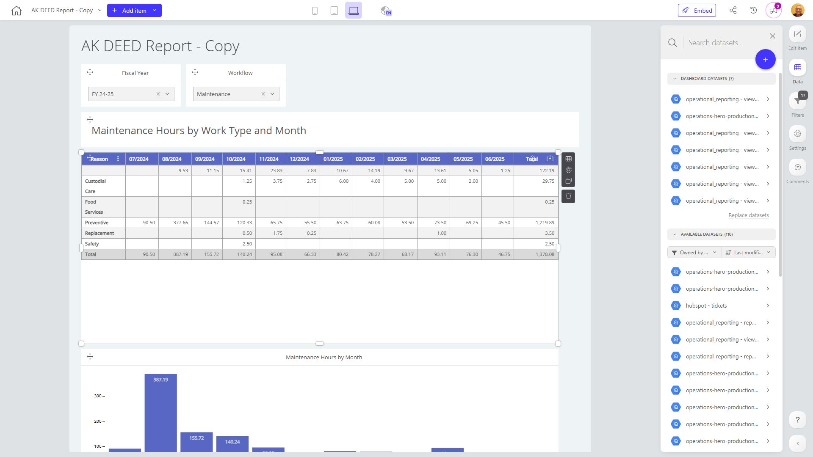

# AK DEED Report - Copy

**Collections:** None

## Screenshot

## Description

This dashboard, titled "AK DEED Report - Copy", appears to be designed to provide comprehensive insights into the maintenance and work order management activities of an organization. It combines a variety of visualizations and data analysis tools to help users understand and monitor different aspects of their maintenance operations.

The dashboard includes several key components:

1. Filters: Users can filter the data by Fiscal Year and Workflow, allowing them to analyze the information from different perspectives.

2. Pivot Tables: There are multiple pivot tables that provide detailed breakdowns and summaries of various maintenance metrics, such as work order counts, hours, and maintenance hours by month.

3. Column Charts: The dashboard features several column charts that compare key metrics, like Initiated Work Orders vs. Completed Work Orders, and Scheduled Work Order Hours vs. Unscheduled Work Order Hours. These visualizations help users quickly identify trends and patterns in the data.

4. Combination Chart: This component combines work order count and work order hour data, providing a more comprehensive view of the organization's unscheduled maintenance activities.

The dashboard appears to be a valuable tool for maintenance managers, operations teams, and leadership who need to monitor and analyze the organization's maintenance performance. It enables users to understand the volume and nature of work orders, identify areas for process improvements, and make data-driven decisions to optimize maintenance activities and resource allocation.

Without access to the actual data, it's difficult to provide more specific insights. However, the dashboard's structure and the variety of component types suggest that it is designed to deliver a comprehensive view of the organization's maintenance operations, enabling users to track key metrics, identify trends, and make informed decisions to improve overall efficiency and effectiveness.

## AI-Generated Summary

This dashboard provides comprehensive insights into the maintenance and work order management activities of an organization. It combines various visualizations and data analysis tools to help users understand and monitor different aspects of their maintenance operations. The dashboard includes filters for Fiscal Year and Workflow, enabling users to analyze the information from different perspectives. It features pivot tables that provide detailed breakdowns and summaries of maintenance metrics, such as work order counts, hours, and maintenance hours by month. The dashboard also includes column charts that compare key metrics, like Initiated Work Orders vs. Completed Work Orders, and Scheduled Work Order Hours vs. Unscheduled Work Order Hours, helping users identify trends and patterns. Additionally, a combination chart displays unscheduled work order counts and hours, providing a comprehensive view of the organization's unscheduled maintenance activities. This dashboard is valuable for maintenance managers, operations teams, and leadership who need to monitor and analyze the organization's maintenance performance, track key metrics, identify areas for improvement, and make data-driven decisions to optimize maintenance activities and resource allocation.

### Tags

`maintenance` `work orders` `operations` `performance monitoring` `data-driven decision making`

---

*Generated on 2026-01-29 12:47:52 by Luzmo API Tools*