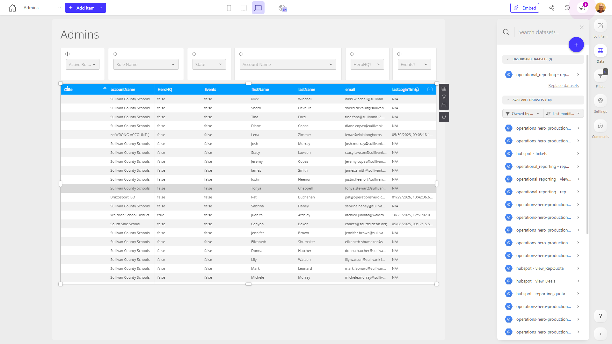

# Admins

**Collections:** None

## Screenshot

## Description

The "Admins" dashboard appears to be a comprehensive tool for managing administrative users and their associated data. Based on the metadata provided, this dashboard consists of 21 components, primarily featuring 18 search and select dropdowns and 3 data tables.

The key features of this dashboard include:

1. **Search & Select Dropdowns**: These components likely allow users to quickly search for and select specific administrative users, filter data, or access user-related information.

2. **Data Tables**: The three data tables seem to provide detailed views of administrative user data, such as user profiles, permissions, and activity logs. These tables likely enable users to review, sort, and analyze administrative user information.

3. **Connected Datasets**: The dashboard appears to be connected to a single dataset, which presumably contains the administrative user data powering the various components.

This dashboard would be most useful for administrative teams responsible for managing and overseeing the organization's administrative users. It likely provides a centralized and efficient way to search, filter, and review user information, as well as monitor user activity and permissions. By consolidating these functionalities into a single dashboard, it can help streamline administrative tasks, improve user management, and ensure compliance with organizational policies and procedures.

Overall, the "Admins" dashboard seems to be a valuable tool for organizations that need to maintain tight control and visibility over their administrative user ecosystem, enabling them to make informed decisions, enforce security protocols, and optimize user management processes.

## AI-Generated Summary

The "Admins" dashboard provides a comprehensive solution for managing and overseeing administrative users within an organization. This dashboard consolidates various search and filter options, as well as detailed data tables, to enable administrative teams to efficiently search, review, and analyze user profiles, permissions, and activity logs. By centralizing these functionalities, the dashboard helps streamline administrative tasks, improve user management, and ensure compliance with organizational policies and procedures. This tool is particularly valuable for organizations that need to maintain tight control and visibility over their administrative user ecosystem, enabling them to make informed decisions, enforce security protocols, and optimize user management processes.

### Tags

`user management` `administrative controls` `compliance` `security` `user permissions`

---

*Generated on 2026-01-29 12:42:46 by Luzmo API Tools*