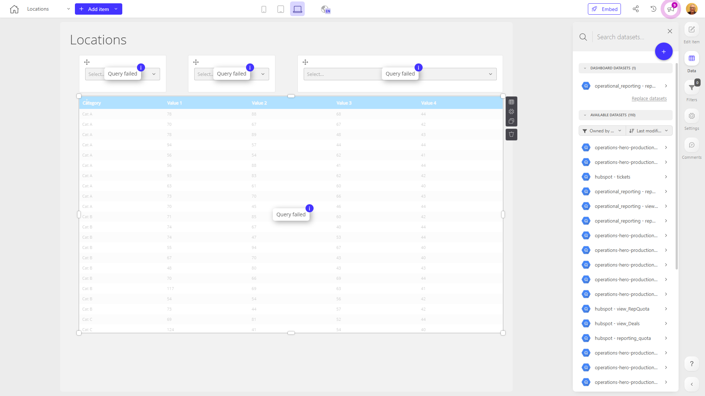

# Locations

**Collections:** None

## Screenshot

## Description

This "Locations" dashboard provides a comprehensive view of key location-based data and insights. The dashboard is designed to help users quickly identify and analyze information related to various locations.

At the core of the dashboard are three data tables that display detailed information about specific locations. These tables likely contain data such as address, contact information, and other pertinent details that allow users to understand the characteristics of different locations.

Surrounding the data tables are a series of nine search and select components. These components enable users to filter and segment the location data in various ways, such as by geographic region, type of location, or other relevant criteria. This allows users to drill down and focus on the specific locations that are most relevant to their needs.

The dashboard likely serves the needs of various stakeholders, such as operations managers, regional planners, or business development professionals, who require a centralized and interactive view of location-based information. By providing easy access to filtered data and the ability to explore different location attributes, this dashboard empowers users to make more informed decisions, optimize operations, and identify new opportunities.

Overall, this "Locations" dashboard is a valuable tool for gaining a holistic understanding of an organization's geographical footprint and location-specific data. Its combination of data tables and filtering capabilities makes it a versatile resource for a wide range of users and use cases.

## AI-Generated Summary

This "Locations" dashboard provides a comprehensive and interactive view of key location-based data and insights. It enables users to quickly access, filter, and analyze information related to various geographic locations, such as addresses, contact details, and other pertinent attributes. The dashboard is designed to serve the needs of stakeholders across the organization, including operations managers, regional planners, and business development professionals, who require a centralized and user-friendly interface to make more informed decisions, optimize operations, and identify new opportunities. With its combination of data tables and advanced search and filtering capabilities, this dashboard empowers users to gain a holistic understanding of the organization's geographical footprint and explore location-specific information in depth.

### Tags

`locations` `geography` `operations` `business intelligence` `regional planning`

---

*Generated on 2026-01-29 11:49:24 by Luzmo API Tools*