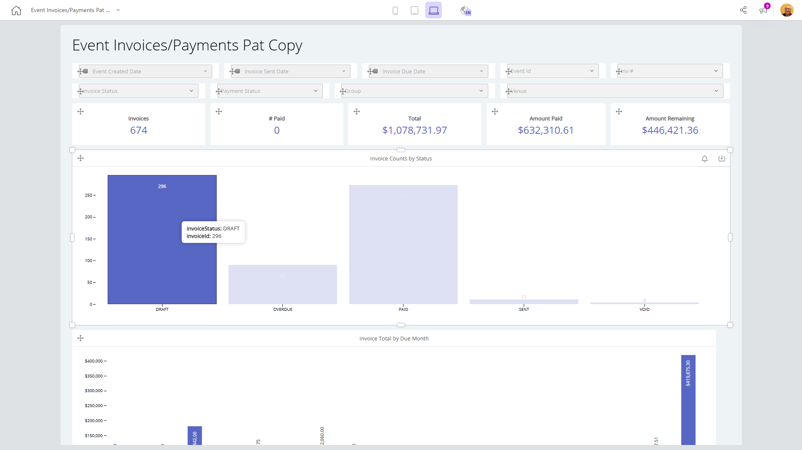

# Event Invoices/Payments Pat Copy

**Collections:** Production Dashboards

## Screenshot

## AI-Generated Summary

This dashboard provides a comprehensive view of event invoices and payments, allowing users to track and analyze key metrics related to invoice status, payment amounts, and top-performing event groups and venues. It includes a variety of visualizations, such as evolution numbers, charts, and pivot tables, which enable users to quickly identify trends, monitor financial performance, and make data-driven decisions. This dashboard would be valuable for event organizers, finance teams, and managers responsible for managing and optimizing event-related invoicing and revenue.

### Tags

`event management` `invoicing` `payments` `financial reporting` `business intelligence`

---

*Generated on 2026-01-29 12:48:38 by Luzmo API Tools*