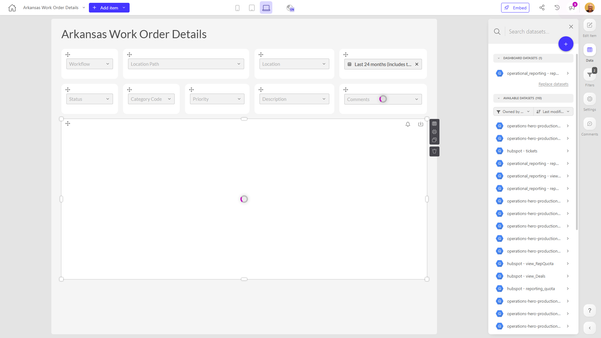

# Arkansas Work Order Details

**Collections:** None

## Screenshot

## Description

The "Arkansas Work Order Details" dashboard is a comprehensive tool designed to provide valuable insights into the state's work order management system. With a total of 30 components, this dashboard offers a rich and interactive experience for users to explore and analyze work order data.

The dashboard primarily consists of 24 dropdown-filter components, which allow users to refine and filter the data based on various criteria such as work order status, location, and other relevant attributes. These filters enable users to quickly identify and focus on specific work orders of interest.

Additionally, the dashboard includes three date-filter components, allowing users to narrow down the time frame and analyze work order details within specific date ranges. This functionality is particularly useful for tracking trends, identifying patterns, and monitoring the progress of work orders over time.

The dashboard also features three regular-table components, which display the detailed information about individual work orders. These tables provide users with a comprehensive view of the work order data, including key details such as work order ID, description, status, and associated costs.

By combining these various components, the "Arkansas Work Order Details" dashboard empowers users, likely including work order managers, maintenance teams, and administrative staff, to gain a deep understanding of the state's work order landscape. They can quickly identify areas for improvement, monitor the efficiency of work order processing, and make data-driven decisions to optimize the overall work order management system.

This dashboard serves as a valuable tool for stakeholders across Arkansas, helping them streamline operations, enhance transparency, and ensure the effective execution of work orders throughout the state.

## AI-Generated Summary

The "Arkansas Work Order Details" dashboard provides a comprehensive view of the state's work order management system, empowering users such as work order managers, maintenance teams, and administrative staff to gain valuable insights and make data-driven decisions. The dashboard offers a rich set of filtering capabilities, allowing users to refine and analyze work order data based on various criteria, including status, location, and time frames. With its interactive tables displaying detailed work order information, this dashboard enables users to track trends, identify patterns, and monitor the progress of work orders, ultimately helping to streamline operations, enhance transparency, and ensure the effective execution of work orders throughout Arkansas.

### Tags

`work orders` `operations management` `maintenance` `data analytics` `dashboard`

---

*Generated on 2026-01-29 12:48:35 by Luzmo API Tools*