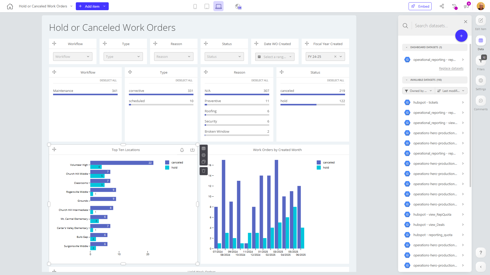

# Hold or Canceled Work Orders

**Collections:** Internal, Production Dashboards

## Screenshot

## Description

This "Hold or Canceled Work Orders" dashboard provides comprehensive visibility and analysis into the status of work orders that have been put on hold or canceled. It is likely used by maintenance and operations teams to understand the reasons, timing, and impact of work orders that did not get completed as originally planned.

The dashboard includes a variety of interactive filters and visualizations to enable users to quickly identify key trends and patterns, such as:

- Workflow, type, reason, and status of hold or canceled work orders
- Fiscal year and date of work order creation
- Top locations and months with the highest volume of hold or canceled work orders

These insights can help the team understand the root causes of work order delays or cancellations, identify problem areas that need more attention, and make data-driven decisions to improve maintenance processes and reduce the occurrence of hold or canceled work orders going forward.

The combination of dropdown filters, slicers, charts, and detailed work order tables gives users the ability to easily explore the data from multiple angles and gain a holistic view of this important operational metric. This dashboard would be valuable for maintenance managers, work order coordinators, and other stakeholders responsible for the efficiency and productivity of the maintenance function.

## AI-Generated Summary

This "Hold or Canceled Work Orders" dashboard provides comprehensive visibility and analysis into the status of work orders that have been put on hold or canceled. It is likely used by maintenance and operations teams to understand the reasons, timing, and impact of work orders that did not get completed as originally planned. The dashboard includes interactive filters and visualizations to help users quickly identify key trends and patterns, such as workflow, type, reason, and status of hold or canceled work orders, as well as fiscal year and date of work order creation, and top locations and months with the highest volume of hold or canceled work orders. These insights can help the team understand the root causes of work order delays or cancellations, identify problem areas that need more attention, and make data-driven decisions to improve maintenance processes and reduce the occurrence of hold or canceled work orders going forward.

### Tags

`maintenance` `work orders` `operations` `analytics` `process improvement`

## Filters

This dashboard has **12 interactive filters**:

- **Filter 1** (slicer-filter)
- **Filter 2** (slicer-filter)
- **Filter 3** (slicer-filter)
- **Filter 4** (slicer-filter)
- **Filter 5** (slicer-filter)
- **Filter 6** (slicer-filter)
- **Filter 7** (slicer-filter)
- **Filter 8** (slicer-filter)
- **Filter 9** (slicer-filter)
- **Filter 10** (slicer-filter)
- **Filter 11** (slicer-filter)
- **Filter 12** (slicer-filter)

---

*Generated on 2026-01-29 12:44:34 by Luzmo API Tools*