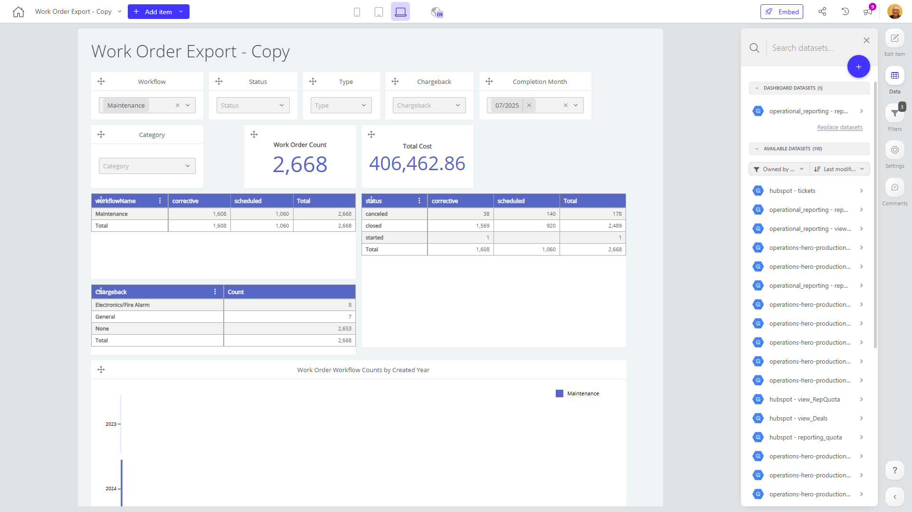

# Work Order Export - Copy

**Collections:** Production Dashboards

## Screenshot

## Description

This dashboard provides a comprehensive view of work order data, catering to the needs of operations and finance teams. It allows users to analyze work order trends, costs, and performance across various dimensions.

The dashboard features a range of interactive components, including dropdown filters, pivot tables, evolution numbers, and bar charts, enabling users to explore the data from multiple perspectives.

Key insights this dashboard can provide include:

1. Work order volume and total cost trends over time, allowing users to understand the scale and financial impact of work orders.
2. Detailed breakdowns of work orders by status, type, category, and workflow, enabling users to identify patterns and areas for process improvements.
3. Pivot tables that facilitate deeper analysis of work order data, such as examining costs or volumes by different combinations of attributes.
4. Visualizations like bar charts that highlight how work order volumes have changed over the years, supporting strategic planning and resource allocation.

This dashboard serves as a valuable tool for operations managers, finance professionals, and other stakeholders who need to monitor, analyze, and report on work order performance. By providing a centralized and interactive view of this data, the dashboard supports data-driven decision-making and helps improve the efficiency and cost-effectiveness of the work order process.

## AI-Generated Summary

This dashboard provides a comprehensive view of work order data, catering to the needs of operations and finance teams. It allows users to analyze work order trends, costs, and performance across various dimensions, such as workflow, status, type, and category. Key insights include work order volume and total cost trends over time, detailed breakdowns of work orders by different attributes, and pivot tables that enable deeper data analysis. This dashboard serves as a valuable tool for operations managers, finance professionals, and other stakeholders who need to monitor, analyze, and report on work order performance, supporting data-driven decision-making and improving the efficiency and cost-effectiveness of the work order process.

### Tags

`work orders` `operations` `finance` `data analysis` `performance monitoring`

---

*Generated on 2026-01-29 12:44:57 by Luzmo API Tools*