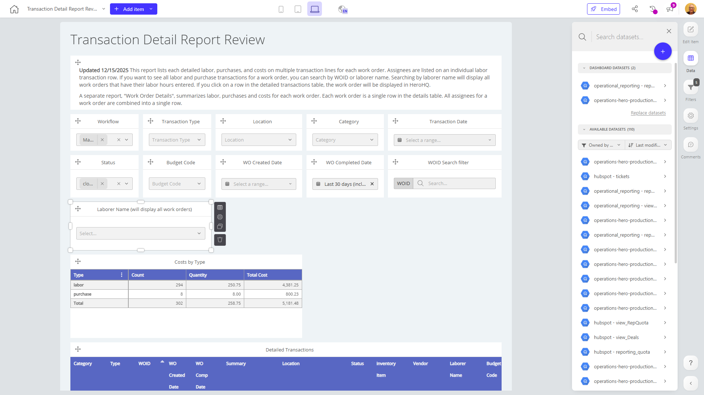

# Transaction Detail Report Review

**Collections:** Production Dashboards

## Screenshot

## Description

The Transaction Detail Report Review dashboard is designed to provide a comprehensive view of financial transactions for an organization. It includes a variety of filtering and visualization components that allow users to analyze transaction data in-depth.

The dashboard's primary purpose is to enable finance and accounting teams to review and monitor transaction activity across the business. Key features include:

- Robust filtering capabilities: Users can filter transactions by workflow, transaction type, location, category, status, budget code, and more, allowing them to quickly drill down into specific areas of interest.
- Date range selection: The dashboard allows users to filter transactions by date ranges, including work order creation and completion dates, to analyze trends over time.
- Powerful search functionality: Users can search for specific work order IDs to quickly access detailed transaction information.
- Transaction breakdown: The dashboard includes pivot tables and regular tables that display a detailed breakdown of transaction types, costs, and other relevant metrics.

This dashboard would be valuable for finance managers, accountants, and other stakeholders who need to thoroughly review and understand the organization's financial transactions. It enables users to gain visibility into transaction patterns, identify potential issues or areas for optimization, and support informed decision-making.

Overall, the Transaction Detail Report Review dashboard provides a comprehensive, flexible, and data-rich solution for analyzing the organization's financial transactions, supporting effective financial management and reporting.

## AI-Generated Summary

The Transaction Detail Report Review dashboard provides a comprehensive view of an organization's financial transactions, enabling finance and accounting teams to thoroughly analyze transaction data and identify patterns, issues, and areas for optimization. The dashboard's robust filtering capabilities, date range selection, and powerful search functionality allow users to quickly drill down into specific transaction details based on criteria like workflow, transaction type, location, category, status, and budget code. The dashboard includes pivot tables and regular tables that display a detailed breakdown of transaction types, costs, and other relevant metrics. This dashboard would be valuable for finance managers, accountants, and other stakeholders who need to gain visibility into the organization's financial transactions and support informed decision-making.

### Tags

`finance` `accounting` `transaction analysis` `financial management` `reporting`

---

*Generated on 2026-01-29 12:47:18 by Luzmo API Tools*