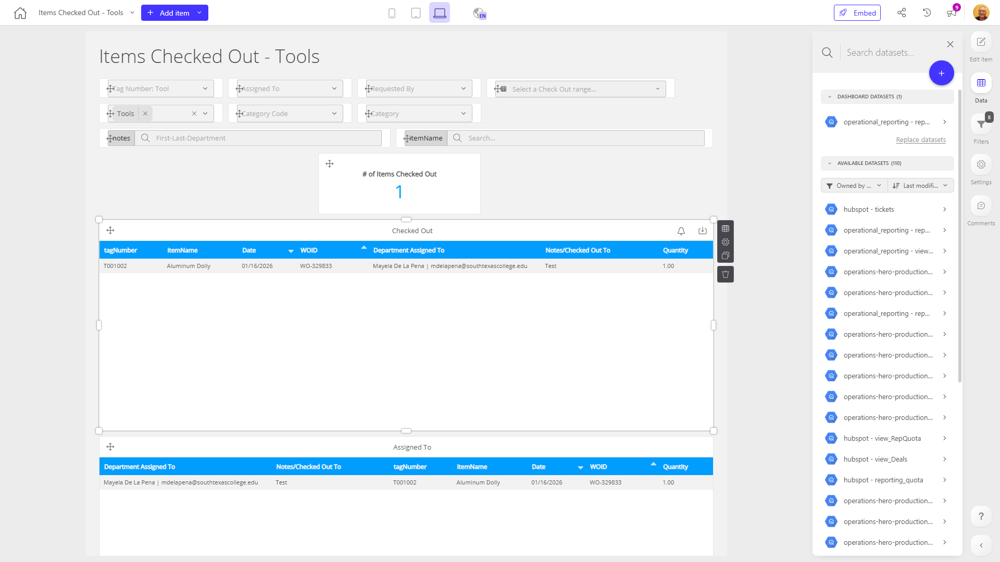

# Items Checked Out - Tools

**Collections:** Client Dashboards, Production Dashboards

## Screenshot

## Description

This "Items Checked Out - Draft" dashboard is designed to provide a comprehensive view of items that have been checked out within an organization. It serves as a centralized hub for tracking and analyzing various aspects of the item checkout process.

The dashboard includes a variety of components that enable users to filter, search, and explore the data:

- Dropdown filters allow users to narrow down the view by specific tag numbers, assigned to individuals, and date ranges.
- Search filters enable users to quickly find items based on key details.
- Regular tables display the list of checked-out items, along with the assigned individuals.
- Pivot tables offer deeper insights, showing the breakdown of checked-out items by individual and by the specific items checked out.

This dashboard would be particularly useful for managers, inventory specialists, or anyone responsible for monitoring and managing the checkout of organizational assets or resources. It provides a clear understanding of who has checked out what items, allowing users to identify trends, spot potential issues, and ensure accountability.

The combination of filtering options, tabular views, and pivot table analytics gives users the flexibility to explore the data from multiple angles and gain valuable insights into the item checkout patterns and utilization within the organization. This dashboard could support a variety of use cases, such as optimizing inventory management, improving asset visibility, and enhancing the overall efficiency of the checkout process.

## AI-Generated Summary

This "Items Checked Out - Tools" dashboard provides a comprehensive overview of items that have been checked out within an organization. It serves as a centralized hub for tracking and analyzing the item checkout process, empowering managers, inventory specialists, and other stakeholders to monitor asset utilization, identify trends, and ensure accountability.

The dashboard offers a range of filtering and search capabilities, allowing users to narrow down the view by tag numbers, assigned individuals, and date ranges. It displays detailed information about checked-out items, including the assigned individuals, in both tabular and pivot table formats. This enables users to gain insights into who has checked out what items, spot potential issues, and optimize inventory management.

The combination of filtering options, data visualization, and analytical capabilities makes this dashboard a valuable tool for improving asset visibility, enhancing the efficiency of the checkout process, and supporting various use cases, such as inventory optimization and resource management.

### Tags

`inventory management` `asset tracking` `checkout process` `resource utilization` `operations`

---

*Generated on 2026-01-29 12:42:03 by Luzmo API Tools*