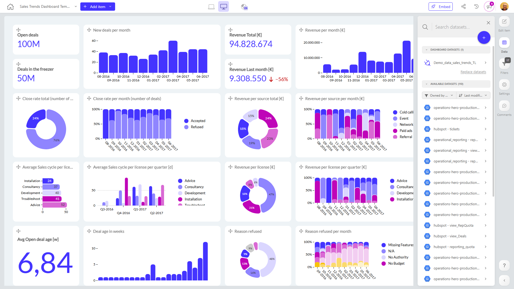

# Sales Trends Dashboard Template - Copy

**Collections:** None

## Screenshot

## Description

This Sales Trends Dashboard provides a comprehensive view of a company's sales performance over time. It is designed to help sales leaders and managers uncover short-term and long-term trends in key sales metrics, identify opportunities for revenue growth, and track the effectiveness of their sales strategies.

The dashboard consolidates data from a single connected dataset and presents it through a variety of visualizations, including column charts, one-number metrics, donut charts, and bar charts. These components cover a range of important sales-related data points, such as:

- Open deals and new deals per month
- Total revenue, revenue per month, and revenue per license
- Close rate (by number of deals) and sales cycle length
- Revenue breakdown by source
- Reasons for deal refusal

By tracking these metrics over time, sales teams can uncover insights such as:

- Which sales channels or product lines are driving the most revenue growth
- How the sales cycle is evolving and impacting close rates
- Where there may be opportunities to improve sales efficiency or target new markets

The range of visualizations and metrics provides a balanced view of sales performance, enabling users to quickly identify areas of strength, weakness, and potential improvement. This dashboard would be valuable for sales leaders, managers, and executives who need to monitor overall sales health, spot emerging trends, and make informed decisions to drive revenue growth.

## AI-Generated Summary

The Sales Trends Dashboard provides a comprehensive view of a company's sales performance, enabling sales leaders and managers to uncover short-term and long-term trends in key metrics, identify revenue growth opportunities, and track the effectiveness of their sales strategies. The dashboard consolidates data from a single connected dataset and presents it through a variety of visualizations, covering important sales-related data points such as open deals, new deals, total revenue, revenue per month, close rates, sales cycle length, revenue breakdown by source, and reasons for deal refusal. By tracking these metrics over time, users can gain insights into which sales channels or product lines are driving the most growth, how the sales cycle is evolving, and where there may be opportunities to improve sales efficiency or target new markets. This dashboard would be valuable for sales teams and executives who need to monitor overall sales health, spot emerging trends, and make informed decisions to drive revenue growth.

### Tags

`sales` `revenue` `performance` `trends` `forecasting`

---

*Generated on 2026-01-29 12:43:18 by Luzmo API Tools*