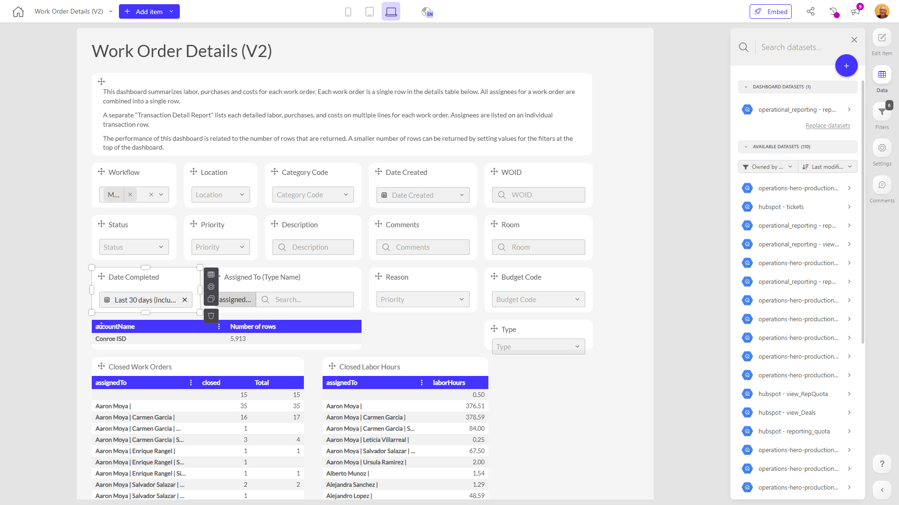

# Work Order Details (V2)

**Collections:** Production Dashboards

## Screenshot

## Description

The "Work Order Details (V2)" dashboard is a comprehensive tool for managing and analyzing work order information. It is designed to provide users, likely facilities managers or operations teams, with a detailed view of work orders across an organization.

The dashboard features a variety of components that allow users to filter, search, and pivot the data to uncover valuable insights. Some key capabilities include:

- Filtering work orders by workflow, location, category code, status, priority, type, reason, and assigned personnel
- Searching for specific work orders by ID, description, comments, room, and assigned personnel
- Viewing a pivot table that summarizes closed work orders, closed labor hours, and assigned personnel by category
- Analyzing work order trends and metrics over time using date-based filters

The dashboard likely connects to a central dataset that contains all the relevant work order information, allowing users to quickly access and manipulate the data as needed.

This dashboard would be highly useful for facilities managers, maintenance teams, and operations personnel who need to stay on top of work orders, track progress, identify bottlenecks, and make data-driven decisions to optimize workflows and resource allocation. The variety of filtering and pivoting capabilities empowers users to customize their view of the data to answer specific questions and uncover insights relevant to their role and responsibilities.

## AI-Generated Summary

The "Work Order Details (V2)" dashboard is a powerful tool for facilities managers, maintenance teams, and operations personnel to efficiently manage and analyze work order data across an organization. This dashboard provides users with a comprehensive view of work orders, allowing them to filter, search, and pivot the data to uncover valuable insights that drive data-driven decision-making.

Key capabilities of the dashboard include the ability to filter work orders by various criteria such as workflow, location, category code, status, priority, type, reason, and assigned personnel. Users can also search for specific work orders by ID, description, comments, room, and assigned personnel. The dashboard features a pivot table that summarizes closed work orders, closed labor hours, and assigned personnel by category, enabling users to identify trends and optimize resource allocation.

This dashboard would be invaluable for organizations that need to maintain and improve their facilities and operations. By providing a centralized and customizable view of work order data, it empowers users to stay on top of work order progress, track metrics, and make informed decisions to enhance overall efficiency and productivity.

### Tags

`work orders` `facilities management` `operations` `data analysis` `decision-making`

---

*Generated on 2026-01-29 12:47:40 by Luzmo API Tools*