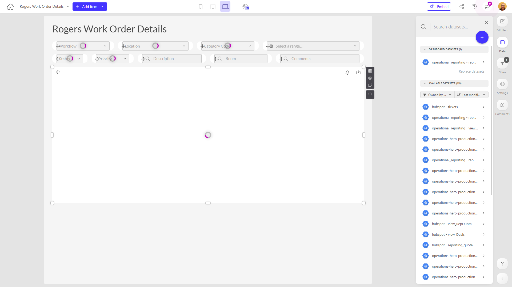

# Rogers Work Order Details

**Collections:** Client Dashboards, Production Dashboards

## Screenshot

## Description

The "Rogers Work Order Details" dashboard is designed to provide a comprehensive view of work order information for Rogers, a company that likely manages various work orders and projects. This dashboard serves as a central hub for accessing and analyzing detailed work order data.

The dashboard consists of 30 components, including 15 dropdown filters, 9 search filters, 3 date filters, and 3 regular tables. The named components suggest that the dashboard allows users to:

1. Search and select various work order details, such as work order status, priority, location, and assigned technicians.
2. Filter work orders by specific date ranges.
3. Perform free-text searches to find relevant work orders.
4. View detailed work order information, including key details and status, in tabular format.

The dashboard is connected to a single dataset, which likely contains the work order data, and has one defined parameter, which could be used to filter or customize the displayed information.

This dashboard would be valuable for Rogers' operations, project management, and service teams, as it enables them to quickly access, filter, and analyze work order details. It helps answer questions such as:
- What is the current status and priority of all active work orders?
- Which work orders are assigned to specific technicians or locations?
- What work orders were opened or completed within a particular date range?
- Can I search for and find specific work orders based on their details or associated information?

By providing a centralized and interactive view of work order data, the "Rogers Work Order Details" dashboard empowers users to make informed decisions, optimize resource allocation, and improve the overall management of Rogers' work order processes.

## AI-Generated Summary

The "Rogers Work Order Details" dashboard provides a comprehensive view of work order information for Rogers, a company that manages various work orders and projects. This interactive dashboard serves as a central hub for accessing, filtering, and analyzing detailed work order data. It enables users, such as operations, project management, and service teams, to quickly search, select, and review work orders based on criteria like status, priority, location, and assigned technicians. The dashboard also allows users to view work orders by date range and perform free-text searches to find specific work orders. By offering a centralized and customizable view of work order data, this dashboard empowers Rogers' teams to make informed decisions, optimize resource allocation, and improve the overall management of their work order processes.

### Tags

`work orders` `operations` `project management` `service management` `data analytics`

---

*Generated on 2026-01-29 12:43:39 by Luzmo API Tools*