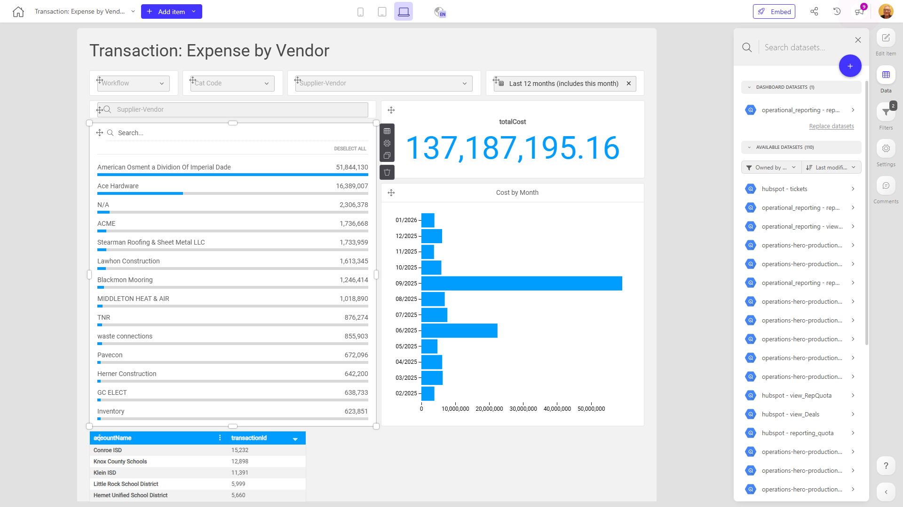

# Transaction: Expense by Vendor

**Collections:** None

## Screenshot

## Description

This "Transaction: Expense by Vendor" dashboard provides a comprehensive view of an organization's vendor expenses and transactions. It is likely used by finance, procurement, or operations teams to monitor and analyze vendor-related spending.

The dashboard includes a variety of interactive components to allow users to filter, slice, and pivot the data in multiple ways:

- Dropdown filters for key attributes like vendor, technician, and transaction type allow users to hone in on specific subsets of the data.
- Date filters enable analysis of expenses over time, while search capabilities allow users to quickly find specific transactions or vendors.
- Slicer filters give users control to focus on high-spend vendors or areas of interest.
- Pivot tables and regular data tables provide detailed views of transaction-level data, expenses by month, and vendor-level spending.
- Charts like bar and column graphs visualize trends in monthly vendor costs and spending by category.

Together, these components allow users to:
- Understand total vendor expenses and how they are trending over time
- Identify high-spend vendors and investigate the drivers behind their costs
- Analyze expenses by transaction type, technician, or other key attributes
- Quickly locate and research specific vendor transactions
- Spot anomalies or areas for potential cost savings

This dashboard likely serves as a central hub for the organization's vendor expense management, empowering users across finance, procurement, and operations to make data-driven decisions about vendor relationships and spending.

## AI-Generated Summary

The "Transaction: Expense by Vendor" dashboard provides a comprehensive view of an organization's vendor expenses and transactions. It empowers finance, procurement, and operations teams to monitor, analyze, and optimize vendor-related spending. The dashboard offers a range of interactive components, including filters, pivot tables, charts, and detailed transaction data, enabling users to understand total vendor expenses, identify high-spend vendors, analyze expenses by various attributes, and quickly locate and research specific vendor transactions. This central hub for vendor expense management helps users make data-driven decisions about vendor relationships and spending.

### Tags

`vendor management` `expense tracking` `procurement` `finance` `operations`

## Filters

This dashboard has **3 interactive filters**:

- **Filter 1** (slicer-filter)
- **Filter 2** (slicer-filter)
- **Filter 3** (slicer-filter)

---

*Generated on 2026-01-29 12:43:09 by Luzmo API Tools*